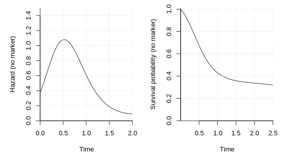
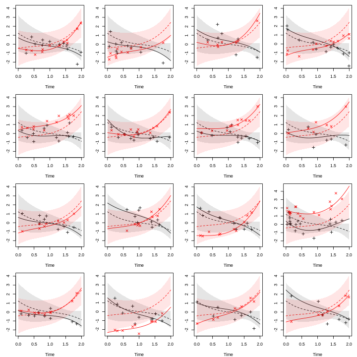
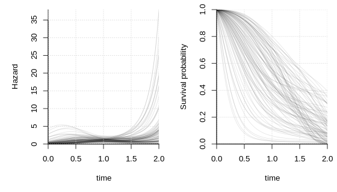

# SimSurvNMarker (Simulate Survival process and Markers)

[](https://travis-ci.org/boennecd/SimSurvNMarker)

The `SimSurvNMarker` package reasonably fast simulates from a joint
survival and marker model. Specifically, the package can simulate from
the
model

<!-- $$\begin{align*} -->

<!-- \vec Y_{ij} \mid \vec U_i = \vec u_i -->

<!--   &\sim N^{(r)}(\vec \mu_i(s_{ij}, \vec u_i), \Sigma) -->

<!--   \\ -->

<!-- \vec\mu_i(s, \vec u) &= -->

<!--   \Gamma^\top \vec x_i + B^\top\vec g(s) + U^\top\vec m(s) -->

<!--   \\ -->

<!-- &= \left(I \otimes \vec x_i^\top\right)\text{vec}\Gamma -->

<!--      + \left(I \otimes \vec g(s)^\top\right)\text{vec} B -->

<!--      + \left(I \otimes \vec m(s)^\top\right) \vec u -->

<!--   \\ -->

<!-- \vec U_i &\sim N^{(K)}(\vec 0, \Psi) -->

<!--   \\ -->

<!-- h(t\mid \vec u) &= \exp\left( -->

<!--   \vec\omega^\top\vec b(t) + -->

<!--   \vec z_i^\top\vec\delta + -->

<!--   \vec\alpha^\top\vec\mu_i(t, \vec u) -->

<!--   \right) -->

<!--   \\ -->

<!-- &= \exp\Bigg( -->

<!--   \vec\omega^\top\vec b(t) + -->

<!--   \vec z_i^\top\vec\delta -->

<!--   + \vec 1^\top\left( -->

<!--   \text{diag}(\vec \alpha) \otimes \vec x_i^\top\right)\text{vec}\Gamma -->

<!--   + \vec 1^\top\left( -->

<!--   \text{diag}(\vec \alpha) \otimes \vec g(t)^\top\right)\text{vec} B \\ -->

<!-- &\hspace{50pt}+ \vec 1^\top\left( -->

<!--   \text{diag}(\vec \alpha) \otimes \vec m(t)^\top\right)\vec u -->

<!--   \Bigg) -->

<!-- \end{align*}$$ -->

  
}(\\vec \\mu_i(s_{ij}, \\vec u_i), \\Sigma)\\\\\\vec\\mu_i(s, \\vec u)&=\\Gamma^\\top\\vec x_i+B^\\top\\vec g(s)+U^\\top\\vec m(s)\\\\&=\\left(I\\otimes\\vec x_i^\\top\\right)\\text{vec}\\Gamma+\\left(I\\otimes\\vec g(s)^\\top\\right)\\text{vec}B+\\left(I\\otimes\\vec m(s)^\\top\\right)\\vec u\\\\\\vec U_i &\\sim N^{(K)}(\\vec 0,\\Psi)\\end{align*}")  

  
![\\begin{align\*}h(t\\mid\\vec u)&=\\exp\\left(\\vec\\omega^\\top\\vec
b(t)+\\vec z\_i^\\top\\vec\\delta+\\vec\\alpha^\\top\\vec\\mu\_i(t,
\\vec u)\\right)\\\\&=\\exp\\Bigg(\\vec\\omega^\\top\\vec b(t)+\\vec
z\_i^\\top\\vec\\delta+\\vec 1^\\top\\left(\\text{diag}(\\vec\\alpha)\\otimes\\vec
x\_i^\\top\\right)\\text{vec}\\Gamma+\\vec 1^\\top\\left(\\text{diag}(\\vec\\alpha)\\otimes\\vec
g(t)^\\top\\right)\\text{vec}
B\\\\&\\hspace{50pt}+\\vec 1^\\top\\left(\\text{diag}(\\vec\\alpha)\\otimes\\vec
m(t)^\\top\\right)\\vec
u\\Bigg)\\end{align\*}](https://render.githubusercontent.com/render/math?math=%5Cbegin%7Balign%2A%7Dh%28t%5Cmid%5Cvec%20u%29%26%3D%5Cexp%5Cleft%28%5Cvec%5Comega%5E%5Ctop%5Cvec%20b%28t%29%2B%5Cvec%20z_i%5E%5Ctop%5Cvec%5Cdelta%2B%5Cvec%5Calpha%5E%5Ctop%5Cvec%5Cmu_i%28t%2C%20%5Cvec%20u%29%5Cright%29%5C%5C%26%3D%5Cexp%5CBigg%28%5Cvec%5Comega%5E%5Ctop%5Cvec%20b%28t%29%2B%5Cvec%20z_i%5E%5Ctop%5Cvec%5Cdelta%2B%5Cvec%201%5E%5Ctop%5Cleft%28%5Ctext%7Bdiag%7D%28%5Cvec%5Calpha%29%5Cotimes%5Cvec%20x_i%5E%5Ctop%5Cright%29%5Ctext%7Bvec%7D%5CGamma%2B%5Cvec%201%5E%5Ctop%5Cleft%28%5Ctext%7Bdiag%7D%28%5Cvec%5Calpha%29%5Cotimes%5Cvec%20g%28t%29%5E%5Ctop%5Cright%29%5Ctext%7Bvec%7D%20B%5C%5C%26%5Chspace%7B50pt%7D%2B%5Cvec%201%5E%5Ctop%5Cleft%28%5Ctext%7Bdiag%7D%28%5Cvec%5Calpha%29%5Cotimes%5Cvec%20m%28t%29%5E%5Ctop%5Cright%29%5Cvec%20u%5CBigg%29%5Cend%7Balign%2A%7D
"\\begin{align*}h(t\\mid\\vec u)&=\\exp\\left(\\vec\\omega^\\top\\vec b(t)+\\vec z_i^\\top\\vec\\delta+\\vec\\alpha^\\top\\vec\\mu_i(t, \\vec u)\\right)\\\\&=\\exp\\Bigg(\\vec\\omega^\\top\\vec b(t)+\\vec z_i^\\top\\vec\\delta+\\vec 1^\\top\\left(\\text{diag}(\\vec\\alpha)\\otimes\\vec x_i^\\top\\right)\\text{vec}\\Gamma+\\vec 1^\\top\\left(\\text{diag}(\\vec\\alpha)\\otimes\\vec g(t)^\\top\\right)\\text{vec} B\\\\&\\hspace{50pt}+\\vec 1^\\top\\left(\\text{diag}(\\vec\\alpha)\\otimes\\vec m(t)^\\top\\right)\\vec u\\Bigg)\\end{align*}")  

where  is individual
’s
th
observed marker at time
,  is individual
’s
random effect, and
 is the
instantaneous hazard rate for the time-to-event outcome.
 is the so-called association parameter. It shows the
strength of the relation between the latent mean function,
"), and the log of the instantaneous rate,
"). "), ") and ") are basis expansions of time. As an example, these can be
a polynomial, a B-spline, or a natural cubic spline. The expansion for
the baseline hazard, "), is typically made on  instead of
. One
reason is that the model reduces to a Weibull distribution when a first
polynomial is used and .  and  are individual specific known covariates.

We provide an example of how to use the package here and the
[inst/test-data](inst/test-data) directory. The purpose of the R package
is to

  - allow the user to specify all components in R including the basis
    functions.
  - simulate reasonably fast from the model given this requirement.

## Installation

The package is not on CRAN but can be installed through

``` r
stopifnot(require(remotes)) # need the remotes package
install_github("boennecd/SimSurvNMarker")
```

## Example: Polynomial

We start with an example where we use polynomials as the basis
functions. First, we assign the polynomial functions we will use.

``` r
b_func <- function(x){
  x <- x - 1
  cbind(x^3, x^2, x)
}
g_func <- function(x){
  x <- x - 1
  cbind(x^3, x^2, x)
}
m_func <- function(x){
  x <- x - 1
  cbind(x^2, x, 1)
}
```

We use a third order polynomial for the two fixed terms,  and , and a second order random polynomial for the random term,
"), in the latent mean function. We choose the following
parameters for the baseline hazard.

``` r
library(SimSurvNMarker)
```

``` r
omega <- c(1.4, -1.2, -2.1)
delta <- -.5 # the intercept

# quadrature nodes
gl_dat <- get_gl_rule(30L)

# hazard function without marker
par(mar = c(5, 5, 1, 1), mfcol = c(1, 2))
plot(function(x) exp(drop(b_func(x) %*% omega) + delta),
     xlim = c(0, 2), ylim = c(0, 1.5), xlab = "Time",
     ylab = "Hazard (no marker)", xaxs = "i",  yaxs = "i", bty = "l")

# survival function without marker
plot(function(x) eval_surv_base_fun(x, omega = omega, b_func = b_func, 
                                    gl_dat = gl_dat, delta = delta), 
     xlim = c(1e-4, 2.5),
     xlab = "Time", ylab = "Survival probability (no marker)", xaxs = "i",
     yaxs = "i", bty = "l", ylim = c(0, 1.01))
abline(h = .75, lty = 3)
abline(h = .25, lty = 3)
```



Then we set the following parameters for the random effect, , and the parameters for the marker process. We also
simulate a number of latent marker mean curves and observed values and
plot the result. The dashed curve is the mean, "), the fully drawn curve is the individual
specific curve, "), the shaded areas are pointwise 95%
interval for each mean curve, and the points are observed markers,
.

``` r
r_n_marker <- function(id)
  # the number of markers is Poisson distributed
  rpois(1, 10) + 1L
r_obs_time <- function(id, n_markes)
  # the observations times are uniform distributed 
  sort(runif(n_markes, 0, 2))

Psi <- structure(c(0.18, 0.05, -0.05, 0.1, -0.02, 0.06, 0.05, 0.34, -0.25, 
                   -0.06, -0.03, 0.29, -0.05, -0.25, 0.24, 0.04, 0.04, 
                   -0.12, 0.1, -0.06, 0.04, 0.34, 0, -0.04, -0.02, -0.03, 
                   0.04, 0, 0.1, -0.08, 0.06, 0.29, -0.12, -0.04, -0.08, 
                   0.51), .Dim = c(6L, 6L))
B <- structure(c(-0.57, 0.17, -0.48, 0.58, 1, 0.86), .Dim = 3:2)
sig <- diag(c(.6, .3)^2)

# function to simulate a given number of individuals' markers' latent means
# and observed values
show_mark_mean <- function(B, Psi, sigma, m_func, g_func, ymax){
  tis <- seq(0, ymax, length.out = 100)
  Psi_chol <- chol(Psi)
  
  par_old <- par(no.readonly = TRUE)
  on.exit(par(par_old))
  par(mar = c(4, 3, 1, 1), mfcol = c(4, 4))
  
  sigma_chol <- chol(sigma)
  n_y <- NCOL(sigma_chol)
  for(i in 1:16){
    U <- draw_U(Psi_chol, n_y = n_y)
    y_non_rng <- t(eval_marker(tis, B = B, g_func = g_func, U = NULL, 
                               offset = NULL, m_func = m_func))
    y_rng     <- t(eval_marker(tis, B = B, g_func = g_func, U = U, 
                               offset = NULL, m_func = m_func))

    sds <- sapply(tis, function(ti){
      M <- (diag(n_y) %x% m_func(ti))
      G <- (diag(n_y) %x% g_func(ti))
      sds <- sqrt(diag(tcrossprod(M %*% Psi, M)))
      cbind(drop(G %*% c(B)) - 1.96 * sds,
            drop(G %*% c(B)) + 1.96 * sds)
    }, simplify = "array")
    lbs <- t(sds[, 1, ])
    ubs <- t(sds[, 2, ])

    y_obs <- sim_marker(B = B, U = U, sigma_chol = sigma_chol, 
                        m_func = m_func, r_n_marker = r_n_marker, 
                        r_obs_time = r_obs_time, g_func = g_func, 
                        offset = NULL)

    matplot(tis, y_non_rng, type = "l", lty = 2, ylab = "", xlab = "Time",
            ylim = range(y_non_rng, y_rng, lbs, ubs, y_obs$y_obs))
    matplot(tis, y_rng    , type = "l", lty = 1, add = TRUE)
    matplot(y_obs$obs_time, y_obs$y_obs, type = "p", add = TRUE, pch = 3:4)

    polygon(c(tis, rev(tis)), c(lbs[, 1], rev(ubs[, 1])), border = NA,
            col = rgb(0, 0, 0, .1))
    polygon(c(tis, rev(tis)), c(lbs[, 2], rev(ubs[, 2])), border = NA,
            col = rgb(1, 0, 0, .1))

  }
  invisible()
}
set.seed(1)
show_mark_mean(B = B, Psi = Psi, sigma = sig, m_func = m_func, 
               g_func = g_func, ymax = 2)
```



As an example, we simulate the random effects and plot the conditional
hazards and survival functions. We start by assigning the association
parameter,
.

``` r
alpha <- c(.5, .9)

# function to plot simulated conditional hazards and survival 
# functions
sim_surv_curves <- function(sig, Psi, delta, omega, alpha, B, m_func, 
                            g_func, b_func, ymax) {
  par_old <- par(no.readonly = TRUE)
  on.exit(par(par_old))
  par(mfcol = c(1, 2), mar = c(5, 5, 1, 1))

  # hazard functions
  tis <- seq(0, ymax, length.out = 50)
  n_y <- NCOL(sig)
  Us <- replicate(100, draw_U(chol(Psi), n_y = n_y), 
                  simplify = "array")

  hz <- apply(Us, 3L, function(U)
    vapply(tis, function(x)
      exp(drop(delta + b_func(x) %*% omega +
                 alpha %*% eval_marker(ti = x, B = B, m_func = m_func, 
                                       g_func = g_func, U = U, 
                                       offset = NULL))),
      FUN.VALUE = numeric(1L)))

  matplot(tis, hz, lty = 1, type = "l", 
          col = rgb(0, 0, 0, .1), xaxs = "i", bty = "l", yaxs = "i", 
          ylim = c(0, max(hz, na.rm = TRUE)), xlab = "time", 
          ylab = "Hazard")

  # survival functions
  ys <- apply(Us, 3L, surv_func_joint,
              ti = tis, B = B, omega = omega, delta = delta,
              alpha = alpha, b_func = b_func, m_func = m_func, 
              gl_dat = gl_dat, g_func = g_func, offset = NULL)

  matplot(tis, ys, lty = 1, type = "l", col = rgb(0, 0, 0, .1),
          xaxs = "i", bty = "l", yaxs = "i", ylim = c(0, 1),
          xlab = "time", ylab = "Survival probability")
  abline(h = .75, lty = 3)
  abline(h = .25, lty = 3)
}

set.seed(1)
sim_surv_curves(sig = sig, Psi = Psi, delta = delta, omega = omega, 
                alpha = alpha, B = B, m_func = m_func, g_func = g_func, 
                b_func = b_func, ymax = 2)
```


We end by assigning the functions to get the covariates, coefficients
for the fixed effects, the left-truncation function, and right-censoring
function.

``` r
r_z <- function(id)
  # return a design matrix for a dummy setup
  cbind(1, (id %% 3) == 1, (id %% 3) == 2)
r_z(1:6) # covariates for the first six individuals
#>      [,1] [,2] [,3]
#> [1,]    1    1    0
#> [2,]    1    0    1
#> [3,]    1    0    0
#> [4,]    1    1    0
#> [5,]    1    0    1
#> [6,]    1    0    0

r_x <- r_z # same covariates for the fixed effects

r_left_trunc <- function(id)
  # no left-truncation
  0
r_right_cens <- function(id)
  # right-censoring time is exponentially distributed
  rexp(1, rate = .5)

# fixed effect coefficients in the hazard
delta_vec <- c(delta, -.5, .5)
# fixed effect coefficients in the marker process 
gamma <- matrix(c(.25, .5, 0, -.4, 0, .3), 3, 2)
```

A full data set can now be simulated as follows.

``` r
set.seed(70483614)
system.time(dat <- sim_joint_data_set(
  n_obs = 1000L, B = B, Psi = Psi, omega = omega, delta = delta_vec,
  alpha = alpha, sigma = sig, b_func = b_func, g_func = g_func,
  m_func = m_func, gl_dat = gl_dat, r_z = r_z, r_left_trunc = r_left_trunc, 
  r_right_cens = r_right_cens, r_n_marker = r_n_marker, 
  r_obs_time = r_obs_time, y_max = 2, gamma = gamma, r_x = r_x))
#>    user  system elapsed 
#>   0.476   0.037   0.513
```

The first entries of the survival data and the observed marker looks as
follows.

``` r
# survival data
head(dat$survival_data)
#>   Z1 Z2 Z3 left_trunc     y event id
#> 1  1  1  0          0 0.213  TRUE  1
#> 2  1  0  1          0 1.580 FALSE  2
#> 3  1  0  0          0 2.000  TRUE  3
#> 4  1  1  0          0 0.343 FALSE  4
#> 5  1  0  1          0 0.132  TRUE  5
#> 6  1  0  0          0 0.920 FALSE  6

# marker data
head(dat$marker_data, 10)
#>    obs_time     Y1     Y2 X1 X2 X3 id
#> 1    0.0217  3.145 -1.354  1  1  0  1
#> 2    0.0603  0.656 -1.469  1  0  1  2
#> 3    0.2706 -0.873 -1.001  1  0  1  2
#> 4    0.4378  0.655 -0.869  1  0  1  2
#> 5    0.5547  0.477 -0.419  1  0  1  2
#> 6    0.2052  0.552 -0.756  1  0  0  3
#> 7    0.2158 -0.345 -0.896  1  0  0  3
#> 8    0.3010  0.764 -1.408  1  0  0  3
#> 9    0.4186  1.234 -1.000  1  0  0  3
#> 10   0.4210  1.026 -0.715  1  0  0  3
```

To illustrate that we simulate from the correct model, we can estimate a
linear mixed models for the markers as follows.

``` r
library(lme4)

# estimate the linear mixed model (skip this if you want and look at the 
# estimates in the end)
local({
  m_dat <- dat$marker_data
  n_y <- NCOL(gamma)
  d_x <- NROW(gamma)
  d_g <- NROW(B)
  d_m <- NROW(Psi) / n_y
  
  Y_names <- paste0("Y", 1:n_y)
  id_vars <- c("id", "obs_time")
  if(d_x > 0)
    id_vars <- c(id_vars, paste0("X", seq_len(d_x)))
  
  lme_dat <- melt(m_dat, id.vars = id_vars, measure.vars = Y_names, 
                  variable.name = "XXTHEVARIABLEXX", 
                  value.name = "XXTHEVALUEXX")
  
  if(length(alpha) > 1){
    if(length(B) > 0L)
      frm <- substitute(
        XXTHEVALUEXX ~
          XXTHEVARIABLEXX : g_func(ti) - 1L +
          (XXTHEVARIABLEXX : m_func(ti) - 1L | i),
        list(ti = as.name("obs_time"), i = as.name("id")))
    else 
      frm <- substitute(
        XXTHEVALUEXX ~
          (XXTHEVARIABLEXX : m_func(ti, m_ks) - 1L | i),
        list(ti = as.name("obs_time"), i = as.name("id")))
    frm <- eval(frm)
    
    if(d_x > 0)
      for(i in rev(seq_len(d_x))){
        frm_call <- substitute(
          update(frm, . ~ XXTHEVARIABLEXX : x_var + .),
          list(x_var = as.name(paste0("X", i))))
        frm <- eval(frm_call)
      }
    
  } else {
    if(length(B) > 0L)
      frm <- substitute(
        XXTHEVALUEXX ~
          ns_func(ti, g_ks) - 1L +
          (ns_func(ti, m_ks) - 1L | i),
        list(ti = as.name("obs_time"), i = as.name("id"), 
             g_ks = as.name("g_ks"), m_ks = as.name("m_ks")))
    else 
      frm <- substitute(
        XXTHEVALUEXX ~
          (ns_func(ti, m_ks) - 1L | i),
        list(ti = as.name("obs_time"), i = as.name("id"), 
             m_ks = as.name("m_ks")))
    frm <- eval(frm)
    
    if(d_x > 0)
      for(i in rev(seq_len(d_x))){
        frm_call <- substitute(
          update(frm, . ~ x_var + .),
          list(x_var = as.name(paste0("X", i))))
        frm <- eval(frm_call)
      }
  }
        
  fit <- lmer(frm, lme_dat, control = lmerControl(
    check.conv.grad = .makeCC("ignore", tol = 1e-3, relTol = NULL)))
  
  gamma <- t(matrix(fixef(fit)[seq_len(d_x * n_y)], nr = n_y))
  
  B <- t(matrix(fixef(fit)[seq_len(d_g * n_y) + (d_x * n_y)], nr = n_y))
  vc <- VarCorr(fit)
  Psi <- vc$id
  attr(Psi, "correlation") <- attr(Psi, "stddev") <- NULL
  dimnames(Psi) <- NULL
  K <- SimSurvNMarker:::get_commutation(n_y, d_m)
  Psi <- tcrossprod(K %*% Psi, K)

  Sigma <- diag(attr(vc, "sc")^2, n_y)

  list(gamma = gamma, B = B, Psi = Psi, Sigma = Sigma)
})
#> $gamma
#>         [,1]    [,2]
#> [1,]  0.1749 -0.3606
#> [2,]  0.5260 -0.0256
#> [3,] -0.0724  0.1897
#> 
#> $B
#>        [,1]  [,2]
#> [1,] -0.564 0.455
#> [2,]  0.267 0.976
#> [3,] -0.467 0.893
#> 
#> $Psi
#>         [,1]    [,2]    [,3]     [,4]     [,5]    [,6]
#> [1,]  0.5240  0.0658 -0.1494  0.12097 -0.04934  0.1091
#> [2,]  0.0658  0.3677 -0.2493 -0.02632 -0.05304  0.2639
#> [3,] -0.1494 -0.2493  0.2572 -0.00560  0.04887 -0.1412
#> [4,]  0.1210 -0.0263 -0.0056  0.15411 -0.00464  0.0533
#> [5,] -0.0493 -0.0530  0.0489 -0.00464  0.04562 -0.0915
#> [6,]  0.1091  0.2639 -0.1412  0.05327 -0.09150  0.4083
#> 
#> $Sigma
#>       [,1]  [,2]
#> [1,] 0.229 0.000
#> [2,] 0.000 0.229
```

Although we assume equal noise variance, the estimates are close to the
true values.

``` r
gamma
#>      [,1] [,2]
#> [1,] 0.25 -0.4
#> [2,] 0.50  0.0
#> [3,] 0.00  0.3
B
#>       [,1] [,2]
#> [1,] -0.57 0.58
#> [2,]  0.17 1.00
#> [3,] -0.48 0.86
Psi
#>       [,1]  [,2]  [,3]  [,4]  [,5]  [,6]
#> [1,]  0.18  0.05 -0.05  0.10 -0.02  0.06
#> [2,]  0.05  0.34 -0.25 -0.06 -0.03  0.29
#> [3,] -0.05 -0.25  0.24  0.04  0.04 -0.12
#> [4,]  0.10 -0.06  0.04  0.34  0.00 -0.04
#> [5,] -0.02 -0.03  0.04  0.00  0.10 -0.08
#> [6,]  0.06  0.29 -0.12 -0.04 -0.08  0.51
sig
#>      [,1] [,2]
#> [1,] 0.36 0.00
#> [2,] 0.00 0.09
```

Fit Cox model with only the observed markers (likely biased but gives us
an idea about whether we are using the correct model).

``` r
local({
  library(survival)
  tdat <- tmerge(dat$survival_data, dat$survival_data, id = id, 
                 tstart = left_trunc, tstop = y, ev = event(y, event))
  
  for(i in seq_along(alpha)){
    new_call <- substitute(tmerge(
      tdat, dat$marker_data, id = id, tdc(obs_time, YVAR)),
      list(YVAR = as.name(paste0("Y", i))))
    names(new_call)[length(new_call)] <- paste0("Y", i)
    tdat <- eval(new_call)
  }
  tdat <- na.omit(tdat)
  
  sformula <- Surv(left_trunc, y, ev) ~ 1
  for(i in seq_along(delta_vec)){
    new_call <- substitute(update(sformula, . ~ . + XVAR), 
                           list(XVAR = as.name(paste0("Z", i))))
    sformula <- eval(new_call)
  }
  for(i in seq_along(alpha)){
    new_call <- substitute(update(sformula, . ~ . + XVAR), 
                           list(XVAR = as.name(paste0("Y", i))))
    sformula <- eval(new_call)
  }
  
  fit <- coxph(sformula, tdat)
  print(summary(fit))  
  invisible(fit)
})
#> Call:
#> coxph(formula = sformula, data = tdat)
#> 
#>   n= 4171, number of events= 649 
#> 
#>       coef exp(coef) se(coef)     z Pr(>|z|)    
#> Z1      NA        NA   0.0000    NA       NA    
#> Z2 -0.5459    0.5793   0.1010 -5.41  6.5e-08 ***
#> Z3  0.6118    1.8437   0.0950  6.44  1.2e-10 ***
#> Y1  0.4858    1.6254   0.0397 12.24  < 2e-16 ***
#> Y2  0.6294    1.8765   0.0427 14.75  < 2e-16 ***
#> ---
#> Signif. codes:  0 '***' 0.001 '**' 0.01 '*' 0.05 '.' 0.1 ' ' 1
#> 
#>    exp(coef) exp(-coef) lower .95 upper .95
#> Z1        NA         NA        NA        NA
#> Z2     0.579      1.726     0.475     0.706
#> Z3     1.844      0.542     1.531     2.221
#> Y1     1.625      0.615     1.504     1.757
#> Y2     1.876      0.533     1.726     2.040
#> 
#> Concordance= 0.692  (se = 0.011 )
#> Likelihood ratio test= 340  on 4 df,   p=<2e-16
#> Wald test            = 342  on 4 df,   p=<2e-16
#> Score (logrank) test = 350  on 4 df,   p=<2e-16
```

This is close-ish to the true values.

``` r
delta_vec
#> [1] -0.5 -0.5  0.5
alpha
#> [1] 0.5 0.9
```

### Using Derivatives

It is possible to use derivatives of the latent mean, "), with respect to time in the hazard. As an
example, we consider the first-order derivative below and plots
conditional hazards and survival functions simulated from the new model.

``` r
g_func_surv <- function(x){
  x <- x - 1
  cbind(3 * x^2, 2 * x, 1)
}
m_func_surv <- function(x){
  x <- x - 1
  cbind(2 * x, 1, 0)
}

set.seed(1)
sim_surv_curves(sig = sig, Psi = Psi, delta = delta, omega = omega, 
                alpha = alpha, B = B, m_func = m_func_surv, 
                g_func = g_func_surv, b_func = b_func, ymax = 2)
```



A new data set can now be simulated as follows.

``` r
set.seed(70483614)
system.time(dat <- sim_joint_data_set(
  n_obs = 1000L, B = B, Psi = Psi, omega = omega, delta = delta_vec,
  alpha = alpha, sigma = sig, b_func = b_func, g_func = g_func,
  m_func = m_func, gl_dat = gl_dat, r_z = r_z, r_left_trunc = r_left_trunc, 
  r_right_cens = r_right_cens, r_n_marker = r_n_marker, 
  r_obs_time = r_obs_time, y_max = 2, gamma = gamma, r_x = r_x, 
  # the additions
  m_func_surv = m_func_surv, g_func_surv = g_func_surv, 
  use_fixed_latent = FALSE))
#>    user  system elapsed 
#>   0.532   0.028   0.559
```

The first entries of the new data looks as follows.

``` r
# survival data
head(dat$survival_data)
#>   Z1 Z2 Z3 left_trunc      y event id
#> 1  1  1  0          0 0.5779  TRUE  1
#> 2  1  0  1          0 0.5093  TRUE  2
#> 3  1  0  0          0 0.6698  TRUE  3
#> 4  1  1  0          0 0.3428 FALSE  4
#> 5  1  0  1          0 0.0496  TRUE  5
#> 6  1  0  0          0 0.9196 FALSE  6

# marker data
head(dat$marker_data, 10)
#>    obs_time     Y1     Y2 X1 X2 X3 id
#> 1    0.0217  3.145 -1.354  1  1  0  1
#> 2    0.4081  2.588 -0.948  1  1  0  1
#> 3    0.4776  3.393 -0.850  1  1  0  1
#> 4    0.5238  2.954 -1.303  1  1  0  1
#> 5    0.0603  0.656 -1.469  1  0  1  2
#> 6    0.2706 -0.873 -1.001  1  0  1  2
#> 7    0.4378  0.655 -0.869  1  0  1  2
#> 8    0.2052  0.552 -0.756  1  0  0  3
#> 9    0.2158 -0.345 -0.896  1  0  0  3
#> 10   0.3010  0.764 -1.408  1  0  0  3
```

## Example: Natural Cubic Spline

In this section, we will use natural cubic spline for the time-varying
basis functions. We start by assigning all the variables that we will
pass to the functions in the package.

``` r
# quadrature nodes
gl_dat <- get_gl_rule(30L)

# spline functions
b_ks <- seq(log(1), log(10), length.out = 4)
m_ks <- seq(0, 10, length.out = 3)
g_ks <- m_ks

# simulation functions
r_n_marker <- function(id)
  rpois(1, 10) + 1L
r_obs_time <- function(id, n_markes)
  sort(runif(n_markes, 0, 10))
r_z <- function(id)
  as.numeric(runif(1L) > .5)
r_x <- function(id)
  numeric()
r_left_trunc <- function(id)
   rbeta(1, 1, 2) * 3
r_right_cens <- function(id)
  rbeta(1, 2, 1) * 6 + 4

# model parameters
omega <- c(-0.96, -2.26, -3.04, .45)
Psi <- structure(c(1.08, 0.12, -0.36, -0.48, 0.36, -0.12, 0.12, 0.36,
                   0, 0.12, 0, -0.12, -0.36, 0, 0.84, 0.12, 0.12, 0.12, -0.48, 0.12,
                   0.12, 0.84, -0.12, 0.24, 0.36, 0, 0.12, -0.12, 0.84, -0.12, -0.12,
                   -0.12, 0.12, 0.24, -0.12, 0.6), .Dim = c(6L, 6L))
B <- structure(c(0.97, 0.01, -0.07, -0.78, -0.86, 0.98), .Dim = 3:2)
sig <- diag(c(.2, .1)^2)
alpha <- c(0.7, 0.6)
delta <- 0.
gamma <- numeric()
```

``` r
b_func <- get_ns_spline(b_ks, do_log = TRUE)
m_func <- get_ns_spline(m_ks, do_log = FALSE)
g_func <- get_ns_spline(g_ks, do_log = FALSE)
```

We show the baseline hazard function and the survival function without
the marker below.

``` r
# hazard function without marker
par(mar = c(5, 5, 1, 1), mfcol = c(1, 2))
plot(function(x) exp(drop(b_func(x) %*% omega)),
     xlim = c(1e-8, 10), ylim = c(0, .61), xlab = "Time",
     ylab = "Hazard (no marker)", xaxs = "i", bty = "l")

# survival function without marker
plot(function(x) eval_surv_base_fun(x, omega = omega, b_func = b_func, 
                                    gl_dat = gl_dat, delta = delta), 
     xlim = c(1e-4, 10),
     xlab = "Time", ylab = "Survival probability (no marker)", xaxs = "i",
     yaxs = "i", bty = "l", ylim = c(0, 1.01))
abline(h = .75, lty = 3)
abline(h = .25, lty = 3)
```


Next, we simulate individual specific markers. Each plot is for a given
individual.

``` r
set.seed(1)
show_mark_mean(B = B, Psi = Psi, sigma = sig, m_func = m_func, 
               g_func = g_func, ymax = 10)
```


We sample a number of random effects and plot the hazard curves and
survival functions given these random effects below.

``` r
set.seed(1)
sim_surv_curves(sig = sig, Psi = Psi, delta = delta, omega = omega, 
                alpha = alpha, B = B, m_func = m_func, g_func = g_func, 
                b_func = b_func, ymax = 10)
```


We end by drawing a data set. We consider the time it takes in seconds
by using the `system.time` function.

``` r
set.seed(70483614)
delta_vec <- 1
system.time(dat <- sim_joint_data_set(
  n_obs = 1000L, B = B, Psi = Psi, omega = omega, delta = delta_vec,
  alpha = alpha, sigma = sig, b_func = b_func, g_func = g_func,
  m_func = m_func, gl_dat = gl_dat, r_z = r_z, r_left_trunc = r_left_trunc, 
  r_right_cens = r_right_cens, r_n_marker = r_n_marker, 
  r_obs_time = r_obs_time, y_max = 10, gamma = gamma, r_x = r_x))
#>    user  system elapsed 
#>   0.549   0.036   0.585
```

Finally, we show a few of the first rows along with some summary
statistics.

``` r
# survival data
head(dat$survival_data)
#>   Z1 left_trunc    y event id
#> 1  0      2.321 6.55  TRUE  1
#> 2  0      1.709 4.20  TRUE  2
#> 3  1      0.230 1.52  TRUE  3
#> 4  1      0.144 6.93 FALSE  4
#> 5  0      0.915 9.06 FALSE  5
#> 6  0      0.709 6.45 FALSE  6

# marker data
head(dat$marker_data, 10)
#>    obs_time      Y1     Y2 id
#> 1     3.095 -0.5767 -1.362  1
#> 2     2.049  0.6875 -0.169  2
#> 3     2.774  0.9111 -0.274  2
#> 4     0.295 -0.3623 -0.405  3
#> 5     0.490  0.0454 -0.292  3
#> 6     2.236  0.2978 -1.426  4
#> 7     2.926  0.2177 -1.596  4
#> 8     4.164  0.5980 -1.453  4
#> 9     4.216  0.2078 -1.889  4
#> 10    4.925  0.0629 -1.583  4

# rate of observed events
mean(dat$survival_data$event) 
#> [1] 0.779

# mean event time
mean(subset(dat$survival_data, event           )$y)
#> [1] 3.67

# mean event time for the two group
mean(subset(dat$survival_data, event & Z1 == 1L)$y)
#> [1] 3.07
mean(subset(dat$survival_data, event & Z1 == 0L)$y)
#> [1] 4.43

# quantiles of the event time
quantile(subset(dat$survival_data, event)$y)
#>     0%    25%    50%    75%   100% 
#> 0.0707 1.6364 2.9435 5.6122 9.6541

# fraction of observed markers per individual
NROW(dat$marker_data) / NROW(dat$survival_data)
#> [1] 4.17
```
