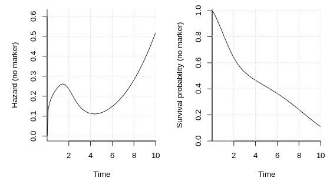
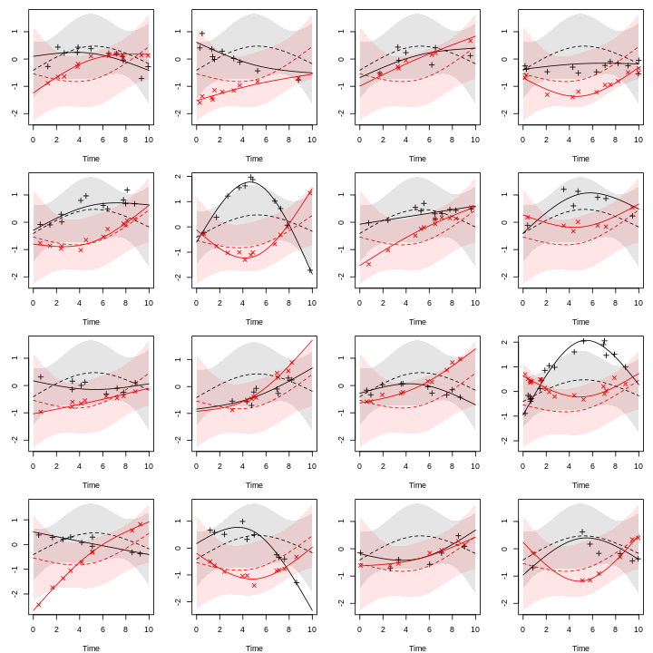
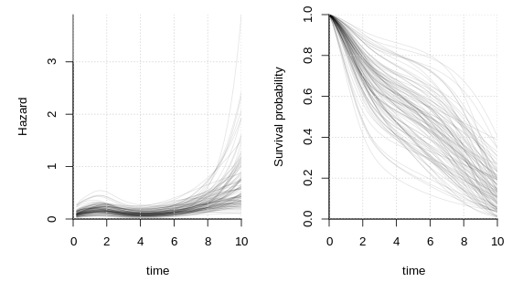

# SimSurvNMarker

[](https://travis-ci.org/boennecd/SimSurvNMarker)

The `SimSurvNMarker` package reasonably fast simulates from a joint
survival and marker model. Specifically, the package can simulate from
the
model

<!-- $$\begin{align*} -->

<!-- \vec Y_{ij} \mid \vec U_i = \vec u_i -->

<!--   &\sim N^{(r)}(\vec \mu_i(s_{ij}, \vec u_i), \Sigma) -->

<!--   \\ -->

<!-- \vec\mu(s, \vec u) &= -->

<!--   \Gamma^\top \vec x_i + B^\top\vec g(s) + U^\top\vec m(s) -->

<!--   \\ -->

<!-- &= \left(I \otimes \vec x_i^\top\right)\text{vec}\Gamma -->

<!--      + \left(I \otimes \vec g(s)^\top\right)\text{vec} B -->

<!--      + \left(I \otimes \vec m(s)^\top\right) \vec u -->

<!--   \\ -->

<!-- \vec U_i &\sim N^{(K)}(\vec 0, \Psi) -->

<!--   \\ -->

<!-- h(t\mid \vec u) &= \exp\left( -->

<!--   \vec\omega^\top\vec b(t) + -->

<!--   \vec z_i^\top\vec\delta + -->

<!--   \vec\alpha^\top\vec\mu(t, \vec u) -->

<!--   \right) -->

<!--   \\ -->

<!-- &= \exp\Bigg( -->

<!--   \vec\omega^\top\vec b(t) + -->

<!--   \vec z_i^\top\vec\delta -->

<!--   + \vec 1^\top\left( -->

<!--   \text{diag}(\vec \alpha) \otimes \vec x_i^\top\right)\text{vec}\Gamma -->

<!--   + \vec 1^\top\left( -->

<!--   \text{diag}(\vec \alpha) \otimes \vec g(t)^\top\right)\text{vec} B \\ -->

<!-- &\hspace{50pt}+ \vec 1^\top\left( -->

<!--   \text{diag}(\vec \alpha) \otimes \vec m(t)^\top\right)\vec u -->

<!--   \Bigg) -->

<!-- \end{align*}$$ -->

  
![\\begin{align\*} \\vec Y\_{ij} \\mid \\vec U\_i = \\vec u\_i &\\sim
N^{(r)}(\\vec \\mu\_i(s\_{ij}, \\vec u\_i), \\Sigma) \\\\ \\vec\\mu(s,
\\vec u) &= \\Gamma^\\top \\vec x\_i + B^\\top\\vec g(s) + U^\\top\\vec
m(s) \\\\ &= \\left(I \\otimes \\vec
x\_i^\\top\\right)\\text{vec}\\Gamma + \\left(I \\otimes \\vec
g(s)^\\top\\right)\\text{vec} B + \\left(I \\otimes \\vec
m(s)^\\top\\right) \\vec u \\\\ \\vec U\_i &\\sim N^{(K)}(\\vec 0,
\\Psi) \\\\ h(t\\mid \\vec u) &= \\exp\\left( \\vec\\omega^\\top\\vec
b(t) + \\vec z\_i^\\top\\vec\\delta + \\vec\\alpha^\\top\\vec\\mu(t,
\\vec u) \\right) \\\\ &= \\exp\\Bigg( \\vec\\omega^\\top\\vec b(t) +
\\vec z\_i^\\top\\vec\\delta + \\vec 1^\\top\\left( \\text{diag}(\\vec
\\alpha) \\otimes \\vec x\_i^\\top\\right)\\text{vec}\\Gamma +
\\vec 1^\\top\\left( \\text{diag}(\\vec \\alpha) \\otimes \\vec
g(t)^\\top\\right)\\text{vec} B \\\\ &\\hspace{50pt}+
\\vec 1^\\top\\left( \\text{diag}(\\vec \\alpha) \\otimes \\vec
m(t)^\\top\\right)\\vec u \\Bigg)
\\end{align\*}](https://latex.codecogs.com/svg.latex?%5Cbegin%7Balign%2A%7D%20%20%5Cvec%20Y_%7Bij%7D%20%5Cmid%20%5Cvec%20U_i%20%3D%20%5Cvec%20u_i%20%20%20%20%26%5Csim%20N%5E%7B%28r%29%7D%28%5Cvec%20%5Cmu_i%28s_%7Bij%7D%2C%20%5Cvec%20u_i%29%2C%20%5CSigma%29%20%20%20%20%5C%5C%20%20%5Cvec%5Cmu%28s%2C%20%5Cvec%20u%29%20%26%3D%20%20%20%20%5CGamma%5E%5Ctop%20%5Cvec%20x_i%20%2B%20B%5E%5Ctop%5Cvec%20g%28s%29%20%2B%20U%5E%5Ctop%5Cvec%20m%28s%29%20%20%20%20%5C%5C%20%20%26%3D%20%5Cleft%28I%20%5Cotimes%20%5Cvec%20x_i%5E%5Ctop%5Cright%29%5Ctext%7Bvec%7D%5CGamma%20%20%20%20%20%20%20%2B%20%5Cleft%28I%20%5Cotimes%20%5Cvec%20g%28s%29%5E%5Ctop%5Cright%29%5Ctext%7Bvec%7D%20B%20%20%20%20%20%20%20%2B%20%5Cleft%28I%20%5Cotimes%20%5Cvec%20m%28s%29%5E%5Ctop%5Cright%29%20%5Cvec%20u%20%20%20%20%5C%5C%20%20%5Cvec%20U_i%20%26%5Csim%20N%5E%7B%28K%29%7D%28%5Cvec%200%2C%20%5CPsi%29%20%20%20%20%5C%5C%20%20h%28t%5Cmid%20%5Cvec%20u%29%20%26%3D%20%5Cexp%5Cleft%28%20%20%20%20%5Cvec%5Comega%5E%5Ctop%5Cvec%20b%28t%29%20%2B%20%20%20%20%5Cvec%20z_i%5E%5Ctop%5Cvec%5Cdelta%20%2B%20%20%20%20%5Cvec%5Calpha%5E%5Ctop%5Cvec%5Cmu%28t%2C%20%5Cvec%20u%29%20%20%20%20%5Cright%29%20%20%20%20%5C%5C%20%20%26%3D%20%5Cexp%5CBigg%28%20%20%20%20%5Cvec%5Comega%5E%5Ctop%5Cvec%20b%28t%29%20%2B%20%20%20%20%5Cvec%20z_i%5E%5Ctop%5Cvec%5Cdelta%20%20%20%20%2B%20%5Cvec%201%5E%5Ctop%5Cleft%28%20%20%20%20%5Ctext%7Bdiag%7D%28%5Cvec%20%5Calpha%29%20%5Cotimes%20%5Cvec%20x_i%5E%5Ctop%5Cright%29%5Ctext%7Bvec%7D%5CGamma%20%20%20%20%2B%20%5Cvec%201%5E%5Ctop%5Cleft%28%20%20%20%20%5Ctext%7Bdiag%7D%28%5Cvec%20%5Calpha%29%20%5Cotimes%20%5Cvec%20g%28t%29%5E%5Ctop%5Cright%29%5Ctext%7Bvec%7D%20B%20%5C%5C%20%20%26%5Chspace%7B50pt%7D%2B%20%5Cvec%201%5E%5Ctop%5Cleft%28%20%20%20%20%5Ctext%7Bdiag%7D%28%5Cvec%20%5Calpha%29%20%5Cotimes%20%5Cvec%20m%28t%29%5E%5Ctop%5Cright%29%5Cvec%20u%20%20%20%20%5CBigg%29%20%20%5Cend%7Balign%2A%7D
"\\begin{align*}  \\vec Y_{ij} \\mid \\vec U_i = \\vec u_i    &\\sim N^{(r)}(\\vec \\mu_i(s_{ij}, \\vec u_i), \\Sigma)    \\\\  \\vec\\mu(s, \\vec u) &=    \\Gamma^\\top \\vec x_i + B^\\top\\vec g(s) + U^\\top\\vec m(s)    \\\\  &= \\left(I \\otimes \\vec x_i^\\top\\right)\\text{vec}\\Gamma       + \\left(I \\otimes \\vec g(s)^\\top\\right)\\text{vec} B       + \\left(I \\otimes \\vec m(s)^\\top\\right) \\vec u    \\\\  \\vec U_i &\\sim N^{(K)}(\\vec 0, \\Psi)    \\\\  h(t\\mid \\vec u) &= \\exp\\left(    \\vec\\omega^\\top\\vec b(t) +    \\vec z_i^\\top\\vec\\delta +    \\vec\\alpha^\\top\\vec\\mu(t, \\vec u)    \\right)    \\\\  &= \\exp\\Bigg(    \\vec\\omega^\\top\\vec b(t) +    \\vec z_i^\\top\\vec\\delta    + \\vec 1^\\top\\left(    \\text{diag}(\\vec \\alpha) \\otimes \\vec x_i^\\top\\right)\\text{vec}\\Gamma    + \\vec 1^\\top\\left(    \\text{diag}(\\vec \\alpha) \\otimes \\vec g(t)^\\top\\right)\\text{vec} B \\\\  &\\hspace{50pt}+ \\vec 1^\\top\\left(    \\text{diag}(\\vec \\alpha) \\otimes \\vec m(t)^\\top\\right)\\vec u    \\Bigg)  \\end{align*}")  

where  is individual
’s
th observed marker at
time ,  is individual
’s random effect, and
 is the instantaneous
hazard rate for the time-to-event outcome.
 is the so-called association parameter. It shows the
strength of the relation between the latent mean function,
"), and the log of the instantaneous rate,
"). "), ") and ") are basis expansions of time. As an example, these can be
a polynomial, a B-spline, or a natural cubic spline. The expansion for
the baseline hazard, "), is typically made on  instead of
. One reason is that the
model reduces to a Weibull distribution when a first polynomial is used
and .  and
 are individual specific known covariates.

The package is not too well documented at this point. Instead we provide
an example of how to use the package here and the
[inst/test-data](inst/test-data) directory.

## Example

We start by assigning all the variables that we will pass to the
functions in the package.

``` r
library(SimSurvNMarker)
```

``` r
# quadrature nodes
gl_dat <- get_gl_rule(30L)

# spline functions
b_ks <- seq(log(1), log(10), length.out = 4)
m_ks <- seq(0, 10, length.out = 3)
g_ks <- m_ks

# simulation functions
r_n_marker <- function()
  rpois(1, 10) + 1L
r_obs_time <- function(n_markes)
  sort(runif(n_markes, 0, 10))
r_z <- function()
  as.numeric(runif(1L) > .5)
r_x <- function()
  numeric()
r_left_trunc <- function()
   rbeta(1, 1, 2) * 3
r_right_cens <- function()
  rbeta(1, 2, 1) * 6 + 4

# model parameters
omega <- c(-0.96, -2.26, -3.04, .45)
Psi <- structure(c(1.08, 0.12, -0.36, -0.48, 0.36, -0.12, 0.12, 0.36,
                   0, 0.12, 0, -0.12, -0.36, 0, 0.84, 0.12, 0.12, 0.12, -0.48, 0.12,
                   0.12, 0.84, -0.12, 0.24, 0.36, 0, 0.12, -0.12, 0.84, -0.12, -0.12,
                   -0.12, 0.12, 0.24, -0.12, 0.6), .Dim = c(6L, 6L))
B <- structure(c(0.97, 0.01, -0.07, -0.78, -0.86, 0.98), .Dim = 3:2)
sig <- diag(c(.2, .1)^2)
alpha <- c(0.7, 0.6)
delta <- 0.
gamma <- numeric()
```

``` r
b_func <- get_ns_spline(b_ks, do_log = TRUE)
m_func <- get_ns_spline(m_ks, do_log = FALSE)
g_func <- get_ns_spline(g_ks, do_log = FALSE)
```

We show the baseline hazard function and the survival function without
the marker below.

``` r
# hazard function without marker
par(mar = c(5, 5, 1, 1))
plot(function(x) exp(drop(b_func(x) %*% omega)),
     xlim = c(1e-8, 10), ylim = c(0, .61), xlab = "Time",
     ylab = "Hazard (no marker)", xaxs = "i", bty = "l")
```



``` r

# survival function without marker
plot(function(x) eval_surv_base_fun(x, omega = omega, b_func = b_func, 
                                    gl_dat = gl_dat, delta = delta), 
     xlim = c(1e-4, 10),
     xlab = "Time", ylab = "Survival probability (no marker)", xaxs = "i",
     yaxs = "i", bty = "l", ylim = c(0, 1.01))
abline(h = .75, lty = 3)
abline(h = .25, lty = 3)
```


Next, we simulate individual specific markers. Each plot is for a given
individual. The dashed curve is the mean, "), the fully drawn curve is the individual
specific curve, "), the shaded areas are pointwise 95% interval
for each mean curve, and the points are observed markers, .

``` r
set.seed(1)
show_mark_mean <- function(B, Psi, sigma, m_func, g_func){
  tis <- seq(0, 10, length.out = 100)
  Psi_chol <- chol(Psi)
  
  par_old <- par(no.readonly = TRUE)
  on.exit(par(par_old))
  par(mar = c(4, 3, 1, 1), mfcol = c(4, 4))
  
  sigma_chol <- chol(sigma)
  n_y <- NCOL(sigma_chol)
  for(i in 1:16){
    U <- draw_U(Psi_chol, n_y = n_y)
    y_non_rng <- t(eval_marker(tis, B = B, g_func = g_func, U = NULL, 
                               offset = NULL, m_func = m_func))
    y_rng     <- t(eval_marker(tis, B = B, g_func = g_func, U = U, 
                               offset = NULL, m_func = m_func))

    sds <- sapply(tis, function(ti){
      M <- (diag(n_y) %x% m_func(ti))
      G <- (diag(n_y) %x% g_func(ti))
      sds <- sqrt(diag(tcrossprod(M %*% Psi, M)))
      cbind(drop(G %*% c(B)) - 1.96 * sds,
            drop(G %*% c(B)) + 1.96 * sds)
    }, simplify = "array")
    lbs <- t(sds[, 1, ])
    ubs <- t(sds[, 2, ])

    y_obs <- sim_marker(B = B, U = U, sigma_chol = sigma_chol, 
                        m_func = m_func, r_n_marker = r_n_marker, 
                        r_obs_time = r_obs_time, g_func = g_func, 
                        offset = NULL)

    matplot(tis, y_non_rng, type = "l", lty = 2, ylab = "", xlab = "Time",
            ylim = range(y_non_rng, y_rng, lbs, ubs, y_obs$y_obs))
    matplot(tis, y_rng    , type = "l", lty = 1, add = TRUE)
    matplot(y_obs$obs_time, y_obs$y_obs, type = "p", add = TRUE, pch = 3:4)

    polygon(c(tis, rev(tis)), c(lbs[, 1], rev(ubs[, 1])), border = NA,
            col = rgb(0, 0, 0, .1))
    polygon(c(tis, rev(tis)), c(lbs[, 2], rev(ubs[, 2])), border = NA,
            col = rgb(1, 0, 0, .1))

  }
  invisible()
}
show_mark_mean(B = B, Psi = Psi, sigma = sig, m_func = m_func, 
               g_func = g_func)
```



We sample a number of random effects and plot the hazard curves and
survival functions given these random effects below.

``` r
set.seed(1)
local({
  par_old <- par(no.readonly = TRUE)
  on.exit(par(par_old))
  par(mfcol = c(1, 2))

  # hazard functions
  tis <- seq(1e-4, 10, length.out = 50)
  n_y <- NCOL(sig)
  Us <- replicate(100, draw_U(chol(Psi), n_y = n_y), 
                  simplify = "array")

  hz <- apply(Us, 3L, function(U)
    vapply(tis, function(x)
      exp(drop(delta + b_func(x) %*% omega +
                 alpha %*% eval_marker(ti = x, B = B, m_func = m_func, 
                                       g_func = g_func, U = U, 
                                       offset = NULL))),
      FUN.VALUE = numeric(1L)))

  matplot(tis, hz, lty = 1, type = "l", col = rgb(0, 0, 0, .1),
          xaxs = "i", bty = "l", yaxs = "i", ylim = c(0, 1),
          xlab = "time", ylab = "Hazard")

  # survival functions
  ys <- apply(Us, 3L, surv_func_joint,
              ti = tis, B = B, omega = omega, delta = delta,
              alpha = alpha, b_func = b_func, m_func = m_func, 
              gl_dat = gl_dat, g_func = g_func, offset = NULL)

  matplot(tis, ys, lty = 1, type = "l", col = rgb(0, 0, 0, .1),
          xaxs = "i", bty = "l", yaxs = "i", ylim = c(0, 1),
          xlab = "time", ylab = "Survival probability")
  abline(h = .75, lty = 3)
  abline(h = .25, lty = 3)
})
```



We end by drawing a data set. We consider the time it takes in seconds
by using the `system.time` function.

``` r
set.seed(70483614)
delta_vec <- 1
system.time(dat <- sim_joint_data_set(
  n_obs = 1000L, B = B, Psi = Psi, omega = omega, delta = delta_vec,
  alpha = alpha, sigma = sig, b_func = b_func, g_func = g_func,
  m_func = m_func, gl_dat = gl_dat, r_z = r_z, r_left_trunc = r_left_trunc, 
  r_right_cens = r_right_cens, r_n_marker = r_n_marker, 
  r_obs_time = r_obs_time, y_max = 10, gamma = gamma, r_x = r_x))
#>    user  system elapsed 
#>    0.61    0.00    0.61
```

Finally, we show a few of the first rows along with some summary
statistics.

``` r
# survival data
head(dat$survival_data)
#>   Z1 left_trunc    y event id
#> 1  0      2.321 6.55  TRUE  1
#> 2  0      1.709 4.20  TRUE  2
#> 3  1      0.230 1.52  TRUE  3
#> 4  1      0.144 6.93 FALSE  4
#> 5  0      0.915 9.06 FALSE  5
#> 6  0      0.709 6.45 FALSE  6

# marker data
head(dat$marker_data, 10)
#>    obs_time      Y1     Y2 id
#> 1     3.095 -0.5767 -1.362  1
#> 2     2.049  0.6875 -0.169  2
#> 3     2.774  0.9111 -0.274  2
#> 4     0.295 -0.3623 -0.405  3
#> 5     0.490  0.0454 -0.292  3
#> 6     2.236  0.2978 -1.426  4
#> 7     2.926  0.2177 -1.596  4
#> 8     4.164  0.5980 -1.453  4
#> 9     4.216  0.2078 -1.889  4
#> 10    4.925  0.0629 -1.583  4

# rate of observed events
mean(dat$survival_data$event) 
#> [1] 0.779

# mean event time
mean(subset(dat$survival_data, event           )$y)
#> [1] 3.67

# mean event time for the two group
mean(subset(dat$survival_data, event & Z1 == 1L)$y)
#> [1] 3.07
mean(subset(dat$survival_data, event & Z1 == 0L)$y)
#> [1] 4.43

# quantiles of the event time
quantile(subset(dat$survival_data, event)$y)
#>     0%    25%    50%    75%   100% 
#> 0.0707 1.6364 2.9435 5.6122 9.6541

# fraction of observed markers per individual
NROW(dat$marker_data) / NROW(dat$survival_data)
#> [1] 4.17
```

## TODOs

  - Allow for derivatives of
     in the hazard.  
  - Provide example in the `man` files that needs it.
