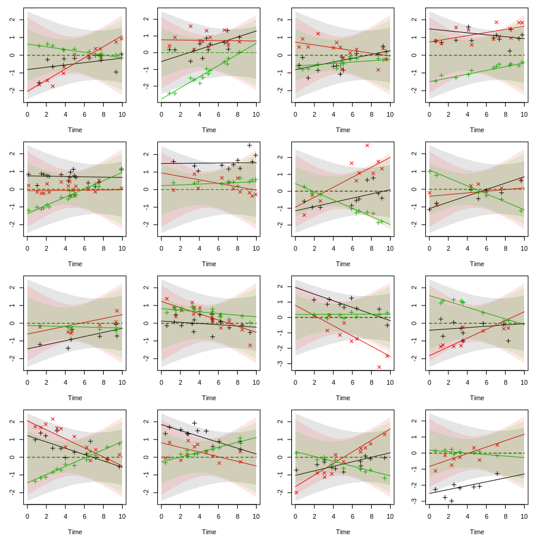
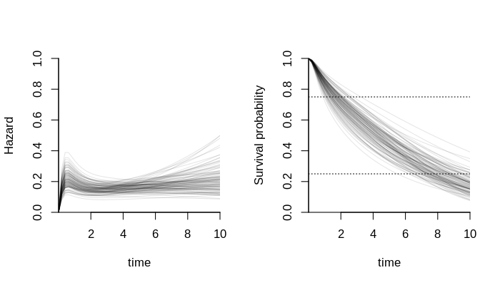

Show configurations

``` r
dput(alpha)
#> c(0.2, -0.25, 0.1)
dput(omega)
#> c(-0.79, -1.25, -4.46, 0.14)
dput(delta)
#> c(-0.05, 0.05, -0.15, -0.16)
dput(gamma)
#> structure(c(-0.23, -0.15, 0.19, -0.16, -0.22, -0.17, 0.2, -0.21, 
#> -0.1, 0.09, 0.13, 0.14), .Dim = 4:3)
dput(B)
#> NULL
dput(sig) # Sigma
#> structure(c(0.14, 0, 0, 0, 0.14, 0, 0, 0, 0.02), .Dim = c(3L, 
#> 3L))
dput(Psi)
#> structure(c(2.58, -0.59, 0.87, -0.61, 0.13, 0.52, -0.59, 1, -0.3, 
#> 0.27, 0.02, 0.2, 0.87, -0.3, 1.12, 0.03, -0.36, 0, -0.61, 0.27, 
#> 0.03, 2.19, -0.2, 0.06, 0.13, 0.02, -0.36, -0.2, 0.85, 0.32, 
#> 0.52, 0.2, 0, 0.06, 0.32, 1.32), .Dim = c(6L, 6L))
dput(n_obs)
#> 2000L
```

Define sampling functions

``` r
r_n_marker <- function(id)
  rpois(1, 10) + 1L
r_obs_time <- function(id, n_markes)
  sort(runif(n_markes, 0, 10))
r_z <- function(id)
  as.numeric(runif(d_z) > .5)
r_x <- function(id)
  as.numeric(runif(d_x) > .5)
r_left_trunc <- function(id)
   rbeta(1, 1, 2) * 3
r_right_cens <- function(id)
  rbeta(1, 2, 1) * 6 + 4
```

Get splines

``` r
b_func <- get_ns_spline(b_ks, do_log = TRUE)
m_func <- get_ns_spline(m_ks, do_log = FALSE)
g_func <- get_ns_spline(g_ks, do_log = FALSE)
```

Get the Gauss-Legendre quadrature nodes we need

``` r
gl_dat <- get_gl_rule(30L)
```

Plot baseline hazard and survival function without the marker

``` r
library(SimSurvNMarker)
```

``` r
# hazard function without marker
par(mar = c(5, 5, 1, 1))
plot(function(x) exp(drop(b_func(x) %*% omega)),
     xlim = c(1e-8, 10), ylim = c(0, .61), xlab = "Time",
     ylab = "Hazard (no marker)", xaxs = "i", bty = "l")
```


``` r

# survival function without marker
plot(function(x) eval_surv_base_fun(x, omega = omega, b_func = b_func, 
                                    gl_dat = gl_dat, delta = NULL), 
     xlim = c(1e-4, 10),
     xlab = "Time", ylab = "Survival probability (no marker)", xaxs = "i",
     yaxs = "i", bty = "l", ylim = c(0, 1.01))
abline(h = .75, lty = 3)
abline(h = .25, lty = 3)
```


Simulate a few markers as an example

``` r
set.seed(1)
show_mark_mean <- function(B, Psi, sigma, m_func, g_func){
  tis <- seq(0, 10, length.out = 100)
  Psi_chol <- chol(Psi)
  
  par_old <- par(no.readonly = TRUE)
  on.exit(par(par_old))
  par(mar = c(4, 3, 1, 1), mfcol = c(4, 4))
  
  sigma_chol <- chol(sigma)
  n_y <- NCOL(sigma_chol)
  for(i in 1:16){
    U <- draw_U(Psi_chol, n_y = n_y)
    y_non_rng <- eval_marker(tis, B = B, g_func = g_func, U = NULL, 
                             offset = NULL, m_func = m_func)
    y_rng     <- eval_marker(tis, B = B, g_func = g_func, U = U, 
                             offset = NULL, m_func = m_func)
    if(length(B) == 0L){
      y_non_rng <- y_rng
      y_non_rng[] <- 0.
    }
    
    if(!is.vector(y_non_rng)){
      y_non_rng <- t(y_non_rng)
      y_rng     <- t(y_rng)
    } else {
      y_non_rng <- as.matrix(y_non_rng)
      y_rng     <- as.matrix(y_rng)
    }

    sds <- sapply(tis, function(ti){
      M <- (diag(n_y) %x% m_func(ti))
      G <- (diag(n_y) %x% g_func(ti))
      sds <- sqrt(diag(tcrossprod(M %*% Psi, M)))
      if(length(B) > 0)
        cbind(drop(G %*% c(B)) - 1.96 * sds,
              drop(G %*% c(B)) + 1.96 * sds)
      else 
        cbind(- 1.96 * sds, 1.96 * sds)
    }, simplify = "array")
    lbs <- sds[, 1, ]
    ubs <- sds[, 2, ]
    if(!is.vector(lbs)){
      lbs <- t(lbs)
      ubs <- t(ubs)
    } else {
      lbs <- as.matrix(lbs)
      ubs <- as.matrix(ubs)
    }

    y_obs <- sim_marker(B = B, U = U, sigma_chol = sigma_chol, 
                        m_func = m_func, r_n_marker = r_n_marker, 
                        r_obs_time = r_obs_time, g_func = g_func, 
                        offset = NULL)

    matplot(tis, y_non_rng, type = "l", lty = 2, ylab = "", xlab = "Time",
            ylim = range(y_non_rng, y_rng, lbs, ubs, y_obs$y_obs))
    matplot(tis, y_rng    , type = "l", lty = 1, add = TRUE)
    matplot(y_obs$obs_time, y_obs$y_obs, type = "p", add = TRUE, pch = 3:4)

    for(i in 1:NCOL(y_non_rng)){
      rg <- col2rgb(i) / 255
      polygon(c(tis, rev(tis)), c(lbs[, i], rev(ubs[, i])), border = NA,
              col = rgb(rg[1], rg[2], rg[3], .1))
    }

  }
  invisible()
}
show_mark_mean(B = B, Psi = Psi, sigma = sig, m_func = m_func, 
               g_func = g_func)
```



Illustrate a few conditional hazard functions and survival functions

``` r
set.seed(1)
local({
  par_old <- par(no.readonly = TRUE)
  on.exit(par(par_old))
  par(mfcol = c(1, 2))

  # hazard functions
  tis <- seq(1e-4, 10, length.out = 50)
  n_y <- NCOL(sig)
  Us <- replicate(100, draw_U(chol(Psi), n_y = n_y), 
                  simplify = "array")

  hz <- apply(Us, 3L, function(U)
    vapply(tis, function(x)
      exp(drop(b_func(x) %*% omega +
                 alpha %*% eval_marker(ti = x, B = B, m_func = m_func, 
                                       g_func = g_func, U = U, 
                                       offset = NULL))),
      FUN.VALUE = numeric(1L)))

  matplot(tis, hz, lty = 1, type = "l", col = rgb(0, 0, 0, .1),
          xaxs = "i", bty = "l", yaxs = "i", ylim = c(0, 1),
          xlab = "time", ylab = "Hazard")

  # survival functions
  ys <- apply(Us, 3L, surv_func_joint,
              ti = tis, B = B, omega = omega, delta = NULL,
              alpha = alpha, b_func = b_func, m_func = m_func, 
              gl_dat = gl_dat, g_func = g_func, offset = NULL)

  matplot(tis, ys, lty = 1, type = "l", col = rgb(0, 0, 0, .1),
          xaxs = "i", bty = "l", yaxs = "i", ylim = c(0, 1),
          xlab = "time", ylab = "Survival probability")
  abline(h = .75, lty = 3)
  abline(h = .25, lty = 3)
})
```



Simulate a data set

``` r
set.seed(1)
system.time(dat <- sim_joint_data_set(
  n_obs = n_obs, B = B, Psi = Psi, omega = omega, delta = delta, 
  alpha = alpha, sigma = sig, gamma = gamma, b_func = b_func, 
  m_func = m_func, g_func = g_func, gl_dat = gl_dat, r_z = r_z, 
  r_left_trunc = r_left_trunc, r_right_cens = r_right_cens, 
  r_n_marker = r_n_marker, r_x = r_x, r_obs_time = r_obs_time, y_max = 10))
#>    user  system elapsed 
#>   0.906   0.043   0.949
```

Show stats

``` r
# survival data
head(dat$survival_data)
#>   Z1 Z2 Z3 Z4 left_trunc    y event id
#> 1  0  0  0  1      0.464 1.63  TRUE  1
#> 2  1  0  1  0      1.131 1.94  TRUE  2
#> 3  1  1  1  0      2.649 7.32 FALSE  3
#> 4  1  1  0  1      2.410 5.07  TRUE  4
#> 5  1  0  0  0      0.497 4.25  TRUE  5
#> 6  1  0  0  0      0.465 6.82  TRUE  6

# marker data
head(dat$marker_data, 10)
#>    obs_time      Y1     Y2      Y3 X1 X2 X3 X4 id
#> 1     0.707 -0.8363 -0.298  0.4825  0  0  1  0  1
#> 2     0.995 -0.9689 -0.356  0.2819  0  0  1  0  1
#> 3     1.809 -2.4469 -1.951  0.4681  0  1  1  0  2
#> 4     3.731 -0.5837 -1.004 -0.4121  1  0  0  0  3
#> 5     4.773 -0.0432 -0.289 -0.4280  1  0  0  0  3
#> 6     5.273 -0.5672 -0.429 -0.1484  1  0  0  0  3
#> 7     3.335 -0.3431 -0.907  0.6525  0  1  0  0  4
#> 8     4.202 -1.2450 -0.852  0.4396  0  1  0  0  4
#> 9     4.369 -0.5993 -0.562  0.0354  0  1  0  0  4
#> 10    4.640 -0.2517 -1.286  0.2029  0  1  0  0  4

# rate of observed events
mean(dat$survival_data$event) 
#> [1] 0.633

# mean event time
mean(subset(dat$survival_data, event)$y)
#> [1] 4.07

# quantiles of the event time
quantile(subset(dat$survival_data, event)$y)
#>    0%   25%   50%   75%  100% 
#> 0.192 2.254 3.882 5.792 9.929

# fraction of observed markers per individual
NROW(dat$marker_data) / NROW(dat$survival_data)
#> [1] 4.95
```

Fit linear mixed model and see that we get estimates which are close to
the true values

``` r
library(lme4)
library(reshape2)
library(splines)
.GlobalEnv$ns_func <- function(x, knots){
  is_bk <- c(1L, length(knots))
  ns(x, knots = knots[-is_bk], Boundary.knots = knots[is_bk], 
     intercept = TRUE)
}

local({
  m_dat <- dat$marker_data
  
  Y_names <- paste0("Y", 1:n_y)
  id_vars <- c("id", "obs_time")
  if(d_x > 0)
    id_vars <- c(id_vars, paste0("X", seq_len(d_x)))
  
  lme_dat <- melt(m_dat, id.vars = id_vars, measure.vars = Y_names, 
                  variable.name = "XXTHEVARIABLEXX", 
                  value.name = "XXTHEVALUEXX")
  
  if(length(alpha) > 1){
    if(length(B) > 0L)
      frm <- substitute(
        XXTHEVALUEXX ~
          XXTHEVARIABLEXX : ns_func(ti, g_ks) - 1L +
          (XXTHEVARIABLEXX : ns_func(ti, m_ks) - 1L | i),
        list(ti = as.name("obs_time"), i = as.name("id"), 
             g_ks = as.name("g_ks"), m_ks = as.name("m_ks")))
    else 
      frm <- substitute(
        XXTHEVALUEXX ~
          (XXTHEVARIABLEXX : ns_func(ti, m_ks) - 1L | i),
        list(ti = as.name("obs_time"), i = as.name("id"), 
             m_ks = as.name("m_ks")))
    frm <- eval(frm)
    
    if(d_x > 0)
      for(i in rev(seq_len(d_x))){
        frm_call <- substitute(
          update(frm, . ~ XXTHEVARIABLEXX : x_var + .),
          list(x_var = as.name(paste0("X", i))))
        frm <- eval(frm_call)
      }
    
  } else {
    if(length(B) > 0L)
      frm <- substitute(
        XXTHEVALUEXX ~
          ns_func(ti, g_ks) - 1L +
          (ns_func(ti, m_ks) - 1L | i),
        list(ti = as.name("obs_time"), i = as.name("id"), 
             g_ks = as.name("g_ks"), m_ks = as.name("m_ks")))
    else 
      frm <- substitute(
        XXTHEVALUEXX ~
          (ns_func(ti, m_ks) - 1L | i),
        list(ti = as.name("obs_time"), i = as.name("id"), 
             m_ks = as.name("m_ks")))
    frm <- eval(frm)
    
    if(d_x > 0)
      for(i in rev(seq_len(d_x))){
        frm_call <- substitute(
          update(frm, . ~ x_var + .),
          list(x_var = as.name(paste0("X", i))))
        frm <- eval(frm_call)
      }
  }
        
  fit <- lmer(frm, lme_dat, control = lmerControl(
    check.conv.grad = .makeCC("ignore", tol = 1e-3, relTol = NULL)))
  
  gamma <- t(matrix(fixef(fit)[seq_len(d_x * n_y)], nr = n_y))
  
  B <- t(matrix(fixef(fit)[seq_len(d_g * n_y) + (d_x * n_y)], nr = n_y))
  vc <- VarCorr(fit)
  Psi <- vc$id
  attr(Psi, "correlation") <- attr(Psi, "stddev") <- NULL
  dimnames(Psi) <- NULL
  K <- SimSurvNMarker:::get_commutation(n_y, d_m)
  Psi <- tcrossprod(K %*% Psi, K)

  Sigma <- diag(attr(vc, "sc")^2, n_y)

  list(gamma = gamma, B = B, Psi = Psi, Sigma = Sigma)
})
#> $gamma
#>          [,1]   [,2]   [,3]
#> [1,]  0.00121 -0.200 -0.225
#> [2,] -0.10313 -0.149 -0.153
#> [3,]  0.07905  0.183  0.217
#> [4,]  0.08897 -0.177 -0.196
#> 
#> $B
#>      [,1] [,2] [,3]
#> 
#> $Psi
#>        [,1]    [,2]    [,3]     [,4]    [,5]     [,6]
#> [1,]  2.603 -0.5744  0.8801 -0.58894  0.1957  0.59685
#> [2,] -0.574  1.1628 -0.3030  0.16400  0.0152  0.16611
#> [3,]  0.880 -0.3030  1.1855  0.10151 -0.3364  0.04070
#> [4,] -0.589  0.1640  0.1015  2.40640 -0.2075 -0.00742
#> [5,]  0.196  0.0152 -0.3364 -0.20754  0.7523  0.29748
#> [6,]  0.597  0.1661  0.0407 -0.00742  0.2975  1.12458
#> 
#> $Sigma
#>        [,1]   [,2]   [,3]
#> [1,] 0.0995 0.0000 0.0000
#> [2,] 0.0000 0.0995 0.0000
#> [3,] 0.0000 0.0000 0.0995
```

Compare with the true values

``` r
gamma
#>       [,1]  [,2]  [,3]
#> [1,] -0.23 -0.22 -0.10
#> [2,] -0.15 -0.17  0.09
#> [3,]  0.19  0.20  0.13
#> [4,] -0.16 -0.21  0.14
B
#> NULL
Psi
#>       [,1]  [,2]  [,3]  [,4]  [,5] [,6]
#> [1,]  2.58 -0.59  0.87 -0.61  0.13 0.52
#> [2,] -0.59  1.00 -0.30  0.27  0.02 0.20
#> [3,]  0.87 -0.30  1.12  0.03 -0.36 0.00
#> [4,] -0.61  0.27  0.03  2.19 -0.20 0.06
#> [5,]  0.13  0.02 -0.36 -0.20  0.85 0.32
#> [6,]  0.52  0.20  0.00  0.06  0.32 1.32
sig
#>      [,1] [,2] [,3]
#> [1,] 0.14 0.00 0.00
#> [2,] 0.00 0.14 0.00
#> [3,] 0.00 0.00 0.02
```

Fit Cox model with only the observed markers (likely biased)

``` r
local({
  library(survival)
  tdat <- tmerge(dat$survival_data, dat$survival_data, id = id, 
                 tstart = left_trunc, tstop = y, ev = event(y, event))
  
  for(i in seq_along(alpha)){
    new_call <- substitute(tmerge(
      tdat, dat$marker_data, id = id, tdc(obs_time, YVAR)),
      list(YVAR = as.name(paste0("Y", i))))
    names(new_call)[length(new_call)] <- paste0("Y", i)
    tdat <- eval(new_call)
  }
  tdat <- na.omit(tdat)
  
  sformula <- Surv(left_trunc, y, ev) ~ 1
  for(i in seq_along(delta)){
    new_call <- substitute(update(sformula, . ~ . + XVAR), 
                           list(XVAR = as.name(paste0("Z", i))))
    sformula <- eval(new_call)
  }
  for(i in seq_along(alpha)){
    new_call <- substitute(update(sformula, . ~ . + XVAR), 
                           list(XVAR = as.name(paste0("Y", i))))
    sformula <- eval(new_call)
  }
  
  fit <- coxph(sformula, tdat)
  print(summary(fit))  
  invisible(fit)
})
#> Call:
#> coxph(formula = sformula, data = tdat)
#> 
#>   n= 9906, number of events= 1267 
#> 
#>       coef exp(coef) se(coef)     z Pr(>|z|)    
#> Z1 -0.0837    0.9197   0.0563 -1.49  0.13715    
#> Z2  0.1204    1.1280   0.0564  2.14  0.03276 *  
#> Z3 -0.1958    0.8222   0.0563 -3.48  0.00051 ***
#> Z4 -0.1957    0.8223   0.0563 -3.48  0.00051 ***
#> Y1  0.1007    1.1059   0.0315  3.19  0.00142 ** 
#> Y2 -0.0887    0.9151   0.0383 -2.32  0.02054 *  
#> Y3  0.2304    1.2591   0.0492  4.68  2.8e-06 ***
#> ---
#> Signif. codes:  0 '***' 0.001 '**' 0.01 '*' 0.05 '.' 0.1 ' ' 1
#> 
#>    exp(coef) exp(-coef) lower .95 upper .95
#> Z1     0.920      1.087     0.824     1.027
#> Z2     1.128      0.887     1.010     1.260
#> Z3     0.822      1.216     0.736     0.918
#> Z4     0.822      1.216     0.736     0.918
#> Y1     1.106      0.904     1.040     1.176
#> Y2     0.915      1.093     0.849     0.986
#> Y3     1.259      0.794     1.143     1.387
#> 
#> Concordance= 0.568  (se = 0.008 )
#> Likelihood ratio test= 75.4  on 7 df,   p=1e-13
#> Wald test            = 74.9  on 7 df,   p=2e-13
#> Score (logrank) test = 74.9  on 7 df,   p=1e-13
```

Compare with the true value

``` r
delta
#> [1] -0.05  0.05 -0.15 -0.16
alpha
#> [1]  0.20 -0.25  0.10
```
