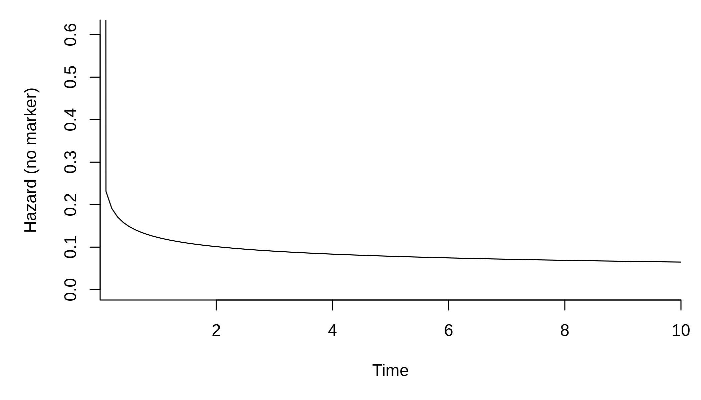
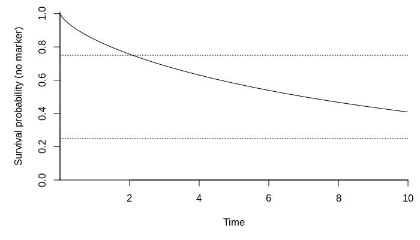
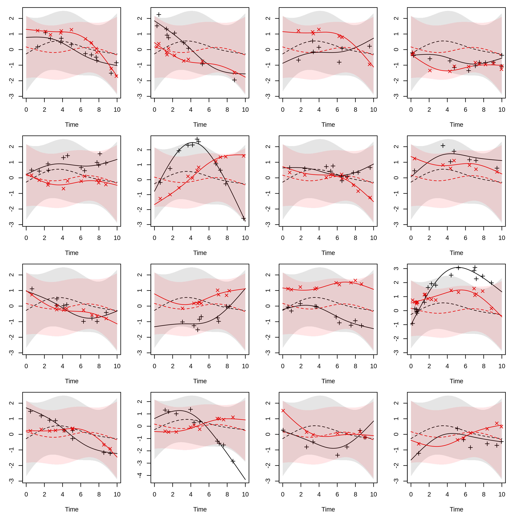
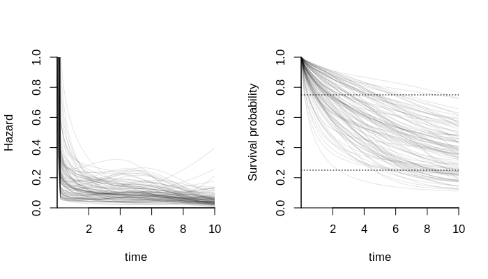

Show configurations

``` r
dput(alpha)
#> c(0.24, 0.49)
dput(omega)
#> c(-4.11, -1.28)
dput(delta)
#> NULL
dput(gamma)
#> structure(c(0.15, -0.21, 0.24, -0.21, 0.16, -0.23, 0.24, -0.18
#> ), .Dim = c(4L, 2L))
dput(B)
#> structure(c(0.95, -0.02, -0.22, -0.27, -0.45, 0.39, -0.05, -0.39
#> ), .Dim = c(4L, 2L))
dput(sig) # Sigma
#> structure(c(0.08, 0, 0, 0.02), .Dim = c(2L, 2L))
dput(Psi)
#> structure(c(2.64, 0.29, -0.34, 1.12, 0.14, 0.74, 0.29, 1.97, 
#> -0.23, -0.1, 0.07, -0.79, -0.34, -0.23, 2.87, -0.45, 0.22, 0.12, 
#> 1.12, -0.1, -0.45, 1.23, 0.45, -0.32, 0.14, 0.07, 0.22, 0.45, 
#> 2.49, 0.09, 0.74, -0.79, 0.12, -0.32, 0.09, 2.03), .Dim = c(6L, 
#> 6L))
dput(n_obs)
#> 2000L
```

Define sampling functions

``` r
r_n_marker <- function(id)
  rpois(1, 10) + 1L
r_obs_time <- function(id, n_markes)
  sort(runif(n_markes, 0, 10))
r_z <- function(id)
  as.numeric(runif(d_z) > .5)
r_x <- function(id)
  as.numeric(runif(d_x) > .5)
r_left_trunc <- function(id)
   rbeta(1, 1, 2) * 3
r_right_cens <- function(id)
  rbeta(1, 2, 1) * 6 + 4
```

Get splines

``` r
b_func <- get_ns_spline(b_ks, do_log = TRUE)
m_func <- get_ns_spline(m_ks, do_log = FALSE)
g_func <- get_ns_spline(g_ks, do_log = FALSE)
```

Get the Gauss-Legendre quadrature nodes we need

``` r
gl_dat <- get_gl_rule(30L)
```

Plot baseline hazard and survival function without the marker

``` r
library(SimSurvNMarker)
```

``` r
# hazard function without marker
par(mar = c(5, 5, 1, 1))
plot(function(x) exp(drop(b_func(x) %*% omega)),
     xlim = c(1e-8, 10), ylim = c(0, .61), xlab = "Time",
     ylab = "Hazard (no marker)", xaxs = "i", bty = "l")
```



``` r

# survival function without marker
plot(function(x) eval_surv_base_fun(x, omega = omega, b_func = b_func, 
                                    gl_dat = gl_dat, delta = NULL), 
     xlim = c(1e-4, 10),
     xlab = "Time", ylab = "Survival probability (no marker)", xaxs = "i",
     yaxs = "i", bty = "l", ylim = c(0, 1.01))
abline(h = .75, lty = 3)
abline(h = .25, lty = 3)
```



Simulate a few markers as an example

``` r
set.seed(1)
show_mark_mean <- function(B, Psi, sigma, m_func, g_func){
  tis <- seq(0, 10, length.out = 100)
  Psi_chol <- chol(Psi)
  
  par_old <- par(no.readonly = TRUE)
  on.exit(par(par_old))
  par(mar = c(4, 3, 1, 1), mfcol = c(4, 4))
  
  sigma_chol <- chol(sigma)
  n_y <- NCOL(sigma_chol)
  for(i in 1:16){
    U <- draw_U(Psi_chol, n_y = n_y)
    y_non_rng <- eval_marker(tis, B = B, g_func = g_func, U = NULL, 
                             offset = NULL, m_func = m_func)
    y_rng     <- eval_marker(tis, B = B, g_func = g_func, U = U, 
                             offset = NULL, m_func = m_func)
    if(length(B) == 0L){
      y_non_rng <- y_rng
      y_non_rng[] <- 0.
    }
    
    if(!is.vector(y_non_rng)){
      y_non_rng <- t(y_non_rng)
      y_rng     <- t(y_rng)
    } else {
      y_non_rng <- as.matrix(y_non_rng)
      y_rng     <- as.matrix(y_rng)
    }

    sds <- sapply(tis, function(ti){
      M <- (diag(n_y) %x% m_func(ti))
      G <- (diag(n_y) %x% g_func(ti))
      sds <- sqrt(diag(tcrossprod(M %*% Psi, M)))
      if(length(B) > 0)
        cbind(drop(G %*% c(B)) - 1.96 * sds,
              drop(G %*% c(B)) + 1.96 * sds)
      else 
        cbind(- 1.96 * sds, 1.96 * sds)
    }, simplify = "array")
    lbs <- sds[, 1, ]
    ubs <- sds[, 2, ]
    if(!is.vector(lbs)){
      lbs <- t(lbs)
      ubs <- t(ubs)
    } else {
      lbs <- as.matrix(lbs)
      ubs <- as.matrix(ubs)
    }

    y_obs <- sim_marker(B = B, U = U, sigma_chol = sigma_chol, 
                        m_func = m_func, r_n_marker = r_n_marker, 
                        r_obs_time = r_obs_time, g_func = g_func, 
                        offset = NULL)

    matplot(tis, y_non_rng, type = "l", lty = 2, ylab = "", xlab = "Time",
            ylim = range(y_non_rng, y_rng, lbs, ubs, y_obs$y_obs))
    matplot(tis, y_rng    , type = "l", lty = 1, add = TRUE)
    matplot(y_obs$obs_time, y_obs$y_obs, type = "p", add = TRUE, pch = 3:4)

    for(i in 1:NCOL(y_non_rng)){
      rg <- col2rgb(i) / 255
      polygon(c(tis, rev(tis)), c(lbs[, i], rev(ubs[, i])), border = NA,
              col = rgb(rg[1], rg[2], rg[3], .1))
    }

  }
  invisible()
}
show_mark_mean(B = B, Psi = Psi, sigma = sig, m_func = m_func, 
               g_func = g_func)
```



Illustrate a few conditional hazard functions and survival functions

``` r
set.seed(1)
local({
  par_old <- par(no.readonly = TRUE)
  on.exit(par(par_old))
  par(mfcol = c(1, 2))

  # hazard functions
  tis <- seq(1e-4, 10, length.out = 50)
  n_y <- NCOL(sig)
  Us <- replicate(100, draw_U(chol(Psi), n_y = n_y), 
                  simplify = "array")

  hz <- apply(Us, 3L, function(U)
    vapply(tis, function(x)
      exp(drop(b_func(x) %*% omega +
                 alpha %*% eval_marker(ti = x, B = B, m_func = m_func, 
                                       g_func = g_func, U = U, 
                                       offset = NULL))),
      FUN.VALUE = numeric(1L)))

  matplot(tis, hz, lty = 1, type = "l", col = rgb(0, 0, 0, .1),
          xaxs = "i", bty = "l", yaxs = "i", ylim = c(0, 1),
          xlab = "time", ylab = "Hazard")

  # survival functions
  ys <- apply(Us, 3L, surv_func_joint,
              ti = tis, B = B, omega = omega, delta = NULL,
              alpha = alpha, b_func = b_func, m_func = m_func, 
              gl_dat = gl_dat, g_func = g_func, offset = NULL)

  matplot(tis, ys, lty = 1, type = "l", col = rgb(0, 0, 0, .1),
          xaxs = "i", bty = "l", yaxs = "i", ylim = c(0, 1),
          xlab = "time", ylab = "Survival probability")
  abline(h = .75, lty = 3)
  abline(h = .25, lty = 3)
})
```



Simulate a data set

``` r
set.seed(1)
system.time(dat <- sim_joint_data_set(
  n_obs = n_obs, B = B, Psi = Psi, omega = omega, delta = delta, 
  alpha = alpha, sigma = sig, gamma = gamma, b_func = b_func, 
  m_func = m_func, g_func = g_func, gl_dat = gl_dat, r_z = r_z, 
  r_left_trunc = r_left_trunc, r_right_cens = r_right_cens, 
  r_n_marker = r_n_marker, r_x = r_x, r_obs_time = r_obs_time, y_max = 10))
#>    user  system elapsed 
#>   1.042   0.046   1.088
```

Show stats

``` r
# survival data
head(dat$survival_data)
#>   left_trunc     y event id
#> 1     0.0122 0.875  TRUE  1
#> 2     1.1822 7.429 FALSE  2
#> 3     0.4808 8.640 FALSE  3
#> 4     1.5553 6.064  TRUE  4
#> 5     0.6044 2.830  TRUE  5
#> 6     0.1165 5.609 FALSE  6

# marker data
head(dat$marker_data, 10)
#>    obs_time      Y1      Y2 X1 X2 X3 X4 id
#> 1     0.134  1.1326  1.0328  0  0  1  1  1
#> 2     1.217 -0.2416 -0.0713  0  0  0  1  2
#> 3     1.433  0.5727  0.0418  0  0  0  1  2
#> 4     2.396 -0.2878 -0.3242  0  0  0  1  2
#> 5     2.455 -0.0765 -0.0767  0  0  0  1  2
#> 6     4.101 -0.0236 -0.1264  0  0  0  1  2
#> 7     4.553  0.0581 -0.1275  0  0  0  1  2
#> 8     6.423 -0.0578 -0.1016  0  0  0  1  2
#> 9     7.111 -0.4707 -0.1517  0  0  0  1  2
#> 10    1.892 -0.0661  0.8521  1  0  0  1  3

# rate of observed events
mean(dat$survival_data$event) 
#> [1] 0.466

# mean event time
mean(subset(dat$survival_data, event)$y)
#> [1] 3.74

# quantiles of the event time
quantile(subset(dat$survival_data, event)$y)
#>     0%    25%    50%    75%   100% 
#> 0.0106 1.8424 3.4080 5.3775 9.7474

# fraction of observed markers per individual
NROW(dat$marker_data) / NROW(dat$survival_data)
#> [1] 5.64
```

Fit linear mixed model and see that we get estimates which are close to
the true values

``` r
library(lme4)
library(reshape2)
library(splines)
.GlobalEnv$ns_func <- function(x, knots){
  is_bk <- c(1L, length(knots))
  ns(x, knots = knots[-is_bk], Boundary.knots = knots[is_bk], 
     intercept = TRUE)
}

local({
  m_dat <- dat$marker_data
  
  Y_names <- paste0("Y", 1:n_y)
  id_vars <- c("id", "obs_time")
  if(d_x > 0)
    id_vars <- c(id_vars, paste0("X", seq_len(d_x)))
  
  lme_dat <- melt(m_dat, id.vars = id_vars, measure.vars = Y_names, 
                  variable.name = "XXTHEVARIABLEXX", 
                  value.name = "XXTHEVALUEXX")
  
  if(length(alpha) > 1){
    if(length(B) > 0L)
      frm <- substitute(
        XXTHEVALUEXX ~
          XXTHEVARIABLEXX : ns_func(ti, g_ks) - 1L +
          (XXTHEVARIABLEXX : ns_func(ti, m_ks) - 1L | i),
        list(ti = as.name("obs_time"), i = as.name("id"), 
             g_ks = as.name("g_ks"), m_ks = as.name("m_ks")))
    else 
      frm <- substitute(
        XXTHEVALUEXX ~
          (XXTHEVARIABLEXX : ns_func(ti, m_ks) - 1L | i),
        list(ti = as.name("obs_time"), i = as.name("id"), 
             m_ks = as.name("m_ks")))
    frm <- eval(frm)
    
    if(d_x > 0)
      for(i in rev(seq_len(d_x))){
        frm_call <- substitute(
          update(frm, . ~ XXTHEVARIABLEXX : x_var + .),
          list(x_var = as.name(paste0("X", i))))
        frm <- eval(frm_call)
      }
    
  } else {
    if(length(B) > 0L)
      frm <- substitute(
        XXTHEVALUEXX ~
          ns_func(ti, g_ks) - 1L +
          (ns_func(ti, m_ks) - 1L | i),
        list(ti = as.name("obs_time"), i = as.name("id"), 
             g_ks = as.name("g_ks"), m_ks = as.name("m_ks")))
    else 
      frm <- substitute(
        XXTHEVALUEXX ~
          (ns_func(ti, m_ks) - 1L | i),
        list(ti = as.name("obs_time"), i = as.name("id"), 
             m_ks = as.name("m_ks")))
    frm <- eval(frm)
    
    if(d_x > 0)
      for(i in rev(seq_len(d_x))){
        frm_call <- substitute(
          update(frm, . ~ x_var + .),
          list(x_var = as.name(paste0("X", i))))
        frm <- eval(frm_call)
      }
  }
        
  fit <- lmer(frm, lme_dat, control = lmerControl(
    check.conv.grad = .makeCC("ignore", tol = 1e-3, relTol = NULL)))
  
  gamma <- t(matrix(fixef(fit)[seq_len(d_x * n_y)], nr = n_y))
  
  B <- t(matrix(fixef(fit)[seq_len(d_g * n_y) + (d_x * n_y)], nr = n_y))
  vc <- VarCorr(fit)
  Psi <- vc$id
  attr(Psi, "correlation") <- attr(Psi, "stddev") <- NULL
  dimnames(Psi) <- NULL
  K <- SimSurvNMarker:::get_commutation(n_y, d_m)
  Psi <- tcrossprod(K %*% Psi, K)

  Sigma <- diag(attr(vc, "sc")^2, n_y)

  list(gamma = gamma, B = B, Psi = Psi, Sigma = Sigma)
})
#> $gamma
#>        [,1]   [,2]
#> [1,]  0.152  0.166
#> [2,] -0.192 -0.176
#> [3,]  0.234  0.208
#> [4,] -0.200 -0.159
#> 
#> $B
#>         [,1]   [,2]
#> [1,]  0.8701 -0.580
#> [2,] -0.0538  0.324
#> [3,] -0.2752 -0.156
#> [4,] -0.2286 -0.312
#> 
#> $Psi
#>        [,1]    [,2]    [,3]    [,4]   [,5]    [,6]
#> [1,]  2.784  0.3048 -0.4208  1.0019 0.1597  0.7366
#> [2,]  0.305  1.8800 -0.3365 -0.0614 0.0385 -0.6881
#> [3,] -0.421 -0.3365  3.1927 -0.3706 0.3303  0.0911
#> [4,]  1.002 -0.0614 -0.3706  1.0311 0.4739 -0.2757
#> [5,]  0.160  0.0385  0.3303  0.4739 2.2944  0.0761
#> [6,]  0.737 -0.6881  0.0911 -0.2757 0.0761  1.7286
#> 
#> $Sigma
#>      [,1] [,2]
#> [1,] 0.05 0.00
#> [2,] 0.00 0.05
```

Compare with the true values

``` r
gamma
#>       [,1]  [,2]
#> [1,]  0.15  0.16
#> [2,] -0.21 -0.23
#> [3,]  0.24  0.24
#> [4,] -0.21 -0.18
B
#>       [,1]  [,2]
#> [1,]  0.95 -0.45
#> [2,] -0.02  0.39
#> [3,] -0.22 -0.05
#> [4,] -0.27 -0.39
Psi
#>       [,1]  [,2]  [,3]  [,4] [,5]  [,6]
#> [1,]  2.64  0.29 -0.34  1.12 0.14  0.74
#> [2,]  0.29  1.97 -0.23 -0.10 0.07 -0.79
#> [3,] -0.34 -0.23  2.87 -0.45 0.22  0.12
#> [4,]  1.12 -0.10 -0.45  1.23 0.45 -0.32
#> [5,]  0.14  0.07  0.22  0.45 2.49  0.09
#> [6,]  0.74 -0.79  0.12 -0.32 0.09  2.03
sig
#>      [,1] [,2]
#> [1,] 0.08 0.00
#> [2,] 0.00 0.02
```

Fit Cox model with only the observed markers (likely biased)

``` r
local({
  library(survival)
  tdat <- tmerge(dat$survival_data, dat$survival_data, id = id, 
                 tstart = left_trunc, tstop = y, ev = event(y, event))
  
  for(i in seq_along(alpha)){
    new_call <- substitute(tmerge(
      tdat, dat$marker_data, id = id, tdc(obs_time, YVAR)),
      list(YVAR = as.name(paste0("Y", i))))
    names(new_call)[length(new_call)] <- paste0("Y", i)
    tdat <- eval(new_call)
  }
  tdat <- na.omit(tdat)
  
  sformula <- Surv(left_trunc, y, ev) ~ 1
  for(i in seq_along(delta)){
    new_call <- substitute(update(sformula, . ~ . + XVAR), 
                           list(XVAR = as.name(paste0("Z", i))))
    sformula <- eval(new_call)
  }
  for(i in seq_along(alpha)){
    new_call <- substitute(update(sformula, . ~ . + XVAR), 
                           list(XVAR = as.name(paste0("Y", i))))
    sformula <- eval(new_call)
  }
  
  fit <- coxph(sformula, tdat)
  print(summary(fit))  
  invisible(fit)
})
#> Call:
#> coxph(formula = sformula, data = tdat)
#> 
#>   n= 11286, number of events= 932 
#> 
#>      coef exp(coef) se(coef)     z Pr(>|z|)    
#> Y1 0.2341    1.2638   0.0324  7.24  4.6e-13 ***
#> Y2 0.4534    1.5736   0.0377 12.04  < 2e-16 ***
#> ---
#> Signif. codes:  0 '***' 0.001 '**' 0.01 '*' 0.05 '.' 0.1 ' ' 1
#> 
#>    exp(coef) exp(-coef) lower .95 upper .95
#> Y1      1.26      0.791      1.19      1.35
#> Y2      1.57      0.635      1.46      1.69
#> 
#> Concordance= 0.633  (se = 0.009 )
#> Likelihood ratio test= 226  on 2 df,   p=<2e-16
#> Wald test            = 223  on 2 df,   p=<2e-16
#> Score (logrank) test = 224  on 2 df,   p=<2e-16
```

Compare with the true value

``` r
delta
#> NULL
alpha
#> [1] 0.24 0.49
```
