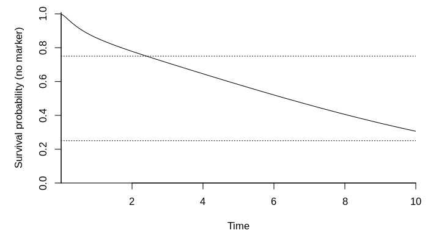

Show configurations

``` r
dput(alpha)
#> c(0.23, -0.07, -0.15)
dput(omega)
#> c(-1.5, -1.35, -1.9, -4.8, -0.17)
dput(delta)
#> c(-0.1, -0.08, 0.03, -0.21)
dput(gamma)
#> NULL
dput(B)
#> structure(c(-0.86, -0.28, -0.58, 0.04, 0.18, -0.12, 0.99, -0.23, 
#> -0.48, -0.24, 0.33, 0.06, 0.3, -0.57, -0.25), .Dim = c(5L, 3L
#> ))
dput(sig) # Sigma
#> structure(c(0.02, 0, 0, 0, 0.15, 0, 0, 0, 0.03), .Dim = c(3L, 
#> 3L))
dput(Psi)
#> structure(c(2.54, -0.64, 0.95, -0.35, -0.73, 0.79, -0.64, 1.91, 
#> -0.66, 0.26, -0.78, 1.08, 0.95, -0.66, 4.13, 1.99, 0.09, -0.94, 
#> -0.35, 0.26, 1.99, 3.86, 0.76, -1.34, -0.73, -0.78, 0.09, 0.76, 
#> 1.99, -1, 0.79, 1.08, -0.94, -1.34, -1, 3.06), .Dim = c(6L, 6L
#> ))
dput(n_obs)
#> 2000L
```

Define sampling functions

``` r
r_n_marker <- function(id)
  rpois(1, 10) + 1L
r_obs_time <- function(id, n_markes)
  sort(runif(n_markes, 0, 10))
r_z <- function(id)
  as.numeric(runif(d_z) > .5)
r_x <- function(id)
  as.numeric(runif(d_x) > .5)
r_left_trunc <- function(id)
   rbeta(1, 1, 2) * 3
r_right_cens <- function(id)
  rbeta(1, 2, 1) * 6 + 4
```

Get splines

``` r
b_func <- get_ns_spline(b_ks, do_log = TRUE)
m_func <- get_ns_spline(m_ks, do_log = FALSE)
g_func <- get_ns_spline(g_ks, do_log = FALSE)
```

Get the Gauss-Legendre quadrature nodes we need

``` r
gl_dat <- get_gl_rule(30L)
```

Plot baseline hazard and survival function without the marker

``` r
library(SimSurvNMarker)
```

``` r
# hazard function without marker
par(mar = c(5, 5, 1, 1))
plot(function(x) exp(drop(b_func(x) %*% omega)),
     xlim = c(1e-8, 10), ylim = c(0, .61), xlab = "Time",
     ylab = "Hazard (no marker)", xaxs = "i", bty = "l")
```


``` r

# survival function without marker
plot(function(x) eval_surv_base_fun(x, omega = omega, b_func = b_func, 
                                    gl_dat = gl_dat, delta = NULL), 
     xlim = c(1e-4, 10),
     xlab = "Time", ylab = "Survival probability (no marker)", xaxs = "i",
     yaxs = "i", bty = "l", ylim = c(0, 1.01))
abline(h = .75, lty = 3)
abline(h = .25, lty = 3)
```



Simulate a few markers as an example

``` r
set.seed(1)
show_mark_mean <- function(B, Psi, sigma, m_func, g_func){
  tis <- seq(0, 10, length.out = 100)
  Psi_chol <- chol(Psi)
  
  par_old <- par(no.readonly = TRUE)
  on.exit(par(par_old))
  par(mar = c(4, 3, 1, 1), mfcol = c(4, 4))
  
  sigma_chol <- chol(sigma)
  n_y <- NCOL(sigma_chol)
  for(i in 1:16){
    U <- draw_U(Psi_chol, n_y = n_y)
    y_non_rng <- eval_marker(tis, B = B, g_func = g_func, U = NULL, 
                             offset = NULL, m_func = m_func)
    y_rng     <- eval_marker(tis, B = B, g_func = g_func, U = U, 
                             offset = NULL, m_func = m_func)
    if(length(B) == 0L){
      y_non_rng <- y_rng
      y_non_rng[] <- 0.
    }
    
    if(!is.vector(y_non_rng)){
      y_non_rng <- t(y_non_rng)
      y_rng     <- t(y_rng)
    } else {
      y_non_rng <- as.matrix(y_non_rng)
      y_rng     <- as.matrix(y_rng)
    }

    sds <- sapply(tis, function(ti){
      M <- (diag(n_y) %x% m_func(ti))
      G <- (diag(n_y) %x% g_func(ti))
      sds <- sqrt(diag(tcrossprod(M %*% Psi, M)))
      if(length(B) > 0)
        cbind(drop(G %*% c(B)) - 1.96 * sds,
              drop(G %*% c(B)) + 1.96 * sds)
      else 
        cbind(- 1.96 * sds, 1.96 * sds)
    }, simplify = "array")
    lbs <- sds[, 1, ]
    ubs <- sds[, 2, ]
    if(!is.vector(lbs)){
      lbs <- t(lbs)
      ubs <- t(ubs)
    } else {
      lbs <- as.matrix(lbs)
      ubs <- as.matrix(ubs)
    }

    y_obs <- sim_marker(B = B, U = U, sigma_chol = sigma_chol, 
                        m_func = m_func, r_n_marker = r_n_marker, 
                        r_obs_time = r_obs_time, g_func = g_func, 
                        offset = NULL)

    matplot(tis, y_non_rng, type = "l", lty = 2, ylab = "", xlab = "Time",
            ylim = range(y_non_rng, y_rng, lbs, ubs, y_obs$y_obs))
    matplot(tis, y_rng    , type = "l", lty = 1, add = TRUE)
    matplot(y_obs$obs_time, y_obs$y_obs, type = "p", add = TRUE, pch = 3:4)

    for(i in 1:NCOL(y_non_rng)){
      rg <- col2rgb(i) / 255
      polygon(c(tis, rev(tis)), c(lbs[, i], rev(ubs[, i])), border = NA,
              col = rgb(rg[1], rg[2], rg[3], .1))
    }

  }
  invisible()
}
show_mark_mean(B = B, Psi = Psi, sigma = sig, m_func = m_func, 
               g_func = g_func)
```


Illustrate a few conditional hazard functions and survival functions

``` r
set.seed(1)
local({
  par_old <- par(no.readonly = TRUE)
  on.exit(par(par_old))
  par(mfcol = c(1, 2))

  # hazard functions
  tis <- seq(1e-4, 10, length.out = 50)
  n_y <- NCOL(sig)
  Us <- replicate(100, draw_U(chol(Psi), n_y = n_y), 
                  simplify = "array")

  hz <- apply(Us, 3L, function(U)
    vapply(tis, function(x)
      exp(drop(b_func(x) %*% omega +
                 alpha %*% eval_marker(ti = x, B = B, m_func = m_func, 
                                       g_func = g_func, U = U, 
                                       offset = NULL))),
      FUN.VALUE = numeric(1L)))

  matplot(tis, hz, lty = 1, type = "l", col = rgb(0, 0, 0, .1),
          xaxs = "i", bty = "l", yaxs = "i", ylim = c(0, 1),
          xlab = "time", ylab = "Hazard")

  # survival functions
  ys <- apply(Us, 3L, surv_func_joint,
              ti = tis, B = B, omega = omega, delta = NULL,
              alpha = alpha, b_func = b_func, m_func = m_func, 
              gl_dat = gl_dat, g_func = g_func, offset = NULL)

  matplot(tis, ys, lty = 1, type = "l", col = rgb(0, 0, 0, .1),
          xaxs = "i", bty = "l", yaxs = "i", ylim = c(0, 1),
          xlab = "time", ylab = "Survival probability")
  abline(h = .75, lty = 3)
  abline(h = .25, lty = 3)
})
```


Simulate a data set

``` r
set.seed(1)
system.time(dat <- sim_joint_data_set(
  n_obs = n_obs, B = B, Psi = Psi, omega = omega, delta = delta, 
  alpha = alpha, sigma = sig, gamma = gamma, b_func = b_func, 
  m_func = m_func, g_func = g_func, gl_dat = gl_dat, r_z = r_z, 
  r_left_trunc = r_left_trunc, r_right_cens = r_right_cens, 
  r_n_marker = r_n_marker, r_x = r_x, r_obs_time = r_obs_time, y_max = 10))
#>    user  system elapsed 
#>   0.780   0.042   0.820
```

Show stats

``` r
# survival data
head(dat$survival_data)
#>   Z1 Z2 Z3 Z4 left_trunc    y event id
#> 1  0  0  1  1     0.0122 4.72  TRUE  1
#> 2  1  1  0  1     0.6534 9.25 FALSE  2
#> 3  1  0  1  1     2.0454 5.69  TRUE  3
#> 4  0  0  0  1     1.5214 8.86 FALSE  4
#> 5  0  0  1  1     1.2304 6.65 FALSE  5
#> 6  1  0  0  0     1.1783 8.91 FALSE  6

# marker data
head(dat$marker_data, 10)
#>    obs_time     Y1      Y2     Y3 id
#> 1     0.134 -2.110 -0.0230 -2.228  1
#> 2     3.403 -1.602  0.3944 -0.641  1
#> 3     3.824 -1.662  0.7110 -0.549  1
#> 4     1.294  1.460  0.5843 -2.089  2
#> 5     2.132  1.275  0.7911 -1.572  2
#> 6     2.703  0.851 -0.0260 -1.576  2
#> 7     3.532  0.743  1.2404 -1.385  2
#> 8     4.781  1.056  0.6243 -1.265  2
#> 9     6.049  0.943  0.8485 -1.241  2
#> 10    6.335  1.290  0.0174 -1.206  2

# rate of observed events
mean(dat$survival_data$event) 
#> [1] 0.45

# mean event time
mean(subset(dat$survival_data, event)$y)
#> [1] 4.35

# quantiles of the event time
quantile(subset(dat$survival_data, event)$y)
#>     0%    25%    50%    75%   100% 
#> 0.0398 2.3923 4.1807 6.2457 9.9280

# fraction of observed markers per individual
NROW(dat$marker_data) / NROW(dat$survival_data)
#> [1] 5.84
```

Fit linear mixed model and see that we get estimates which are close to
the true values

``` r
library(lme4)
library(reshape2)
library(splines)
.GlobalEnv$ns_func <- function(x, knots){
  is_bk <- c(1L, length(knots))
  ns(x, knots = knots[-is_bk], Boundary.knots = knots[is_bk], 
     intercept = TRUE)
}

local({
  m_dat <- dat$marker_data
  
  Y_names <- paste0("Y", 1:n_y)
  id_vars <- c("id", "obs_time")
  if(d_x > 0)
    id_vars <- c(id_vars, paste0("X", seq_len(d_x)))
  
  lme_dat <- melt(m_dat, id.vars = id_vars, measure.vars = Y_names, 
                  variable.name = "XXTHEVARIABLEXX", 
                  value.name = "XXTHEVALUEXX")
  
  if(length(alpha) > 1){
    if(length(B) > 0L)
      frm <- substitute(
        XXTHEVALUEXX ~
          XXTHEVARIABLEXX : ns_func(ti, g_ks) - 1L +
          (XXTHEVARIABLEXX : ns_func(ti, m_ks) - 1L | i),
        list(ti = as.name("obs_time"), i = as.name("id"), 
             g_ks = as.name("g_ks"), m_ks = as.name("m_ks")))
    else 
      frm <- substitute(
        XXTHEVALUEXX ~
          (XXTHEVARIABLEXX : ns_func(ti, m_ks) - 1L | i),
        list(ti = as.name("obs_time"), i = as.name("id"), 
             m_ks = as.name("m_ks")))
    frm <- eval(frm)
    
    if(d_x > 0)
      for(i in rev(seq_len(d_x))){
        frm_call <- substitute(
          update(frm, . ~ XXTHEVARIABLEXX : x_var + .),
          list(x_var = as.name(paste0("X", i))))
        frm <- eval(frm_call)
      }
    
  } else {
    if(length(B) > 0L)
      frm <- substitute(
        XXTHEVALUEXX ~
          ns_func(ti, g_ks) - 1L +
          (ns_func(ti, m_ks) - 1L | i),
        list(ti = as.name("obs_time"), i = as.name("id"), 
             g_ks = as.name("g_ks"), m_ks = as.name("m_ks")))
    else 
      frm <- substitute(
        XXTHEVALUEXX ~
          (ns_func(ti, m_ks) - 1L | i),
        list(ti = as.name("obs_time"), i = as.name("id"), 
             m_ks = as.name("m_ks")))
    frm <- eval(frm)
    
    if(d_x > 0)
      for(i in rev(seq_len(d_x))){
        frm_call <- substitute(
          update(frm, . ~ x_var + .),
          list(x_var = as.name(paste0("X", i))))
        frm <- eval(frm_call)
      }
  }
        
  fit <- lmer(frm, lme_dat, control = lmerControl(
    check.conv.grad = .makeCC("ignore", tol = 1e-3, relTol = NULL)))
  
  gamma <- t(matrix(fixef(fit)[seq_len(d_x * n_y)], nr = n_y))
  
  B <- t(matrix(fixef(fit)[seq_len(d_g * n_y) + (d_x * n_y)], nr = n_y))
  vc <- VarCorr(fit)
  Psi <- vc$id
  attr(Psi, "correlation") <- attr(Psi, "stddev") <- NULL
  dimnames(Psi) <- NULL
  K <- SimSurvNMarker:::get_commutation(n_y, d_m)
  Psi <- tcrossprod(K %*% Psi, K)

  Sigma <- diag(attr(vc, "sc")^2, n_y)

  list(gamma = gamma, B = B, Psi = Psi, Sigma = Sigma)
})
#> $gamma
#>      [,1] [,2] [,3]
#> 
#> $B
#>         [,1]   [,2]    [,3]
#> [1,] -0.8394 -0.104  0.3189
#> [2,] -0.2813  0.988  0.0243
#> [3,] -0.5645 -0.290  0.3203
#> [4,]  0.0257 -0.411 -0.6358
#> [5,]  0.1623 -0.160 -0.1941
#> 
#> $Psi
#>        [,1]   [,2]     [,3]   [,4]     [,5]   [,6]
#> [1,]  2.448 -0.658  0.91551 -0.370 -0.68033  0.808
#> [2,] -0.658  1.863 -0.62568  0.357 -0.83016  1.094
#> [3,]  0.916 -0.626  4.24013  2.037  0.00844 -0.936
#> [4,] -0.370  0.357  2.03693  4.031  0.64275 -1.183
#> [5,] -0.680 -0.830  0.00844  0.643  1.90085 -0.961
#> [6,]  0.808  1.094 -0.93570 -1.183 -0.96148  2.968
#> 
#> $Sigma
#>        [,1]   [,2]   [,3]
#> [1,] 0.0669 0.0000 0.0000
#> [2,] 0.0000 0.0669 0.0000
#> [3,] 0.0000 0.0000 0.0669
```

Compare with the true values

``` r
gamma
#> NULL
B
#>       [,1]  [,2]  [,3]
#> [1,] -0.86 -0.12  0.33
#> [2,] -0.28  0.99  0.06
#> [3,] -0.58 -0.23  0.30
#> [4,]  0.04 -0.48 -0.57
#> [5,]  0.18 -0.24 -0.25
Psi
#>       [,1]  [,2]  [,3]  [,4]  [,5]  [,6]
#> [1,]  2.54 -0.64  0.95 -0.35 -0.73  0.79
#> [2,] -0.64  1.91 -0.66  0.26 -0.78  1.08
#> [3,]  0.95 -0.66  4.13  1.99  0.09 -0.94
#> [4,] -0.35  0.26  1.99  3.86  0.76 -1.34
#> [5,] -0.73 -0.78  0.09  0.76  1.99 -1.00
#> [6,]  0.79  1.08 -0.94 -1.34 -1.00  3.06
sig
#>      [,1] [,2] [,3]
#> [1,] 0.02 0.00 0.00
#> [2,] 0.00 0.15 0.00
#> [3,] 0.00 0.00 0.03
```

Fit Cox model with only the observed markers (likely biased)

``` r
local({
  library(survival)
  tdat <- tmerge(dat$survival_data, dat$survival_data, id = id, 
                 tstart = left_trunc, tstop = y, ev = event(y, event))
  
  for(i in seq_along(alpha)){
    new_call <- substitute(tmerge(
      tdat, dat$marker_data, id = id, tdc(obs_time, YVAR)),
      list(YVAR = as.name(paste0("Y", i))))
    names(new_call)[length(new_call)] <- paste0("Y", i)
    tdat <- eval(new_call)
  }
  tdat <- na.omit(tdat)
  
  sformula <- Surv(left_trunc, y, ev) ~ 1
  for(i in seq_along(delta)){
    new_call <- substitute(update(sformula, . ~ . + XVAR), 
                           list(XVAR = as.name(paste0("Z", i))))
    sformula <- eval(new_call)
  }
  for(i in seq_along(alpha)){
    new_call <- substitute(update(sformula, . ~ . + XVAR), 
                           list(XVAR = as.name(paste0("Y", i))))
    sformula <- eval(new_call)
  }
  
  fit <- coxph(sformula, tdat)
  print(summary(fit))  
  invisible(fit)
})
#> Call:
#> coxph(formula = sformula, data = tdat)
#> 
#>   n= 11687, number of events= 900 
#> 
#>       coef exp(coef) se(coef)     z Pr(>|z|)    
#> Z1 -0.1679    0.8454   0.0670 -2.51    0.012 *  
#> Z2 -0.0493    0.9519   0.0668 -0.74    0.460    
#> Z3  0.1668    1.1815   0.0668  2.50    0.013 *  
#> Z4 -0.3339    0.7162   0.0671 -4.97  6.5e-07 ***
#> Y1  0.2983    1.3475   0.0359  8.32  < 2e-16 ***
#> Y2 -0.0686    0.9337   0.0273 -2.52    0.012 *  
#> Y3 -0.1361    0.8727   0.0345 -3.94  8.2e-05 ***
#> ---
#> Signif. codes:  0 '***' 0.001 '**' 0.01 '*' 0.05 '.' 0.1 ' ' 1
#> 
#>    exp(coef) exp(-coef) lower .95 upper .95
#> Z1     0.845      1.183     0.741     0.964
#> Z2     0.952      1.051     0.835     1.085
#> Z3     1.181      0.846     1.036     1.347
#> Z4     0.716      1.396     0.628     0.817
#> Y1     1.348      0.742     1.256     1.446
#> Y2     0.934      1.071     0.885     0.985
#> Y3     0.873      1.146     0.816     0.934
#> 
#> Concordance= 0.583  (se = 0.01 )
#> Likelihood ratio test= 120  on 7 df,   p=<2e-16
#> Wald test            = 121  on 7 df,   p=<2e-16
#> Score (logrank) test = 121  on 7 df,   p=<2e-16
```

Compare with the true value

``` r
delta
#> [1] -0.10 -0.08  0.03 -0.21
alpha
#> [1]  0.23 -0.07 -0.15
```
