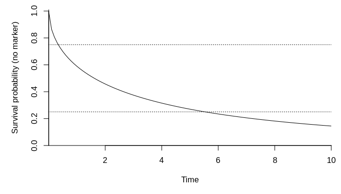

Assign parameters

``` r
alpha <- c(-0.42, 0.23)
omega <- c(-2.28, -1.69)
delta <- c(0.03, 0.23, 0.11, 0.23)
gamma <- structure(c(0.06, 0.2, -0.18, -0.27, 0.23, 0.16), .Dim = 3:2)
B <- structure(c(-0.68, 0.99, 0.06, 0.03, -0.97, 0.39), .Dim = 3:2)
sig <- structure(c(0.01, 0, 0, 0.04), .Dim = c(2L, 2L))
Psi <- structure(c(1.97, -0.24, -0.63, 0.29, -0.24, 0.35, -0.04, 0.16, 
                   -0.63, -0.04, 3.22, -1.39, 0.29, 0.16, -1.39, 3.1),
                 .Dim = c(4L, 4L))
n_obs <- 2000L

n_y <- length(alpha)
d_m <- NROW(Psi) / n_y
d_g <- NROW(B)
d_b <- length(omega)
d_z <- length(delta)
d_x <- NROW(gamma)
```

Define sampling functions

``` r
r_n_marker <- function(id)
  as.integer((id %% 4) * 2L + 1L)
r_obs_time <- function(id, n_markes)
  sort(runif(n_markes, 0, 10))
r_z <- function(id)
  as.numeric((id %% 5) == 1:4)
r_x <- function(id)
  as.numeric((id %% 4) == 1:3)
r_left_trunc <- function(id)
   id / 1000
r_right_cens <- function(id)
  10 - id / 1000
```

Get splines

``` r
b_ks <- seq(log(1e-1), log(10), length.out = d_b)
m_ks <- seq(       0 ,     10 , length.out = d_m)
g_ks <- seq(       0 ,     10 , length.out = d_g)

b_func <- get_ns_spline(b_ks, do_log = TRUE)
m_func <- get_ns_spline(m_ks, do_log = FALSE)
g_func <- get_ns_spline(g_ks, do_log = FALSE)
```

Get the Gauss-Legendre quadrature nodes we need

``` r
gl_dat <- get_gl_rule(30L)
```

Plot baseline hazard and survival function without the marker

``` r
library(SimSurvNMarker)
```

``` r
# hazard function without marker
par(mar = c(5, 5, 1, 1))
plot(function(x) exp(drop(b_func(x) %*% omega)),
     xlim = c(1e-8, 10), ylim = c(0, .61), xlab = "Time",
     ylab = "Hazard (no marker)", xaxs = "i", bty = "l")
```


``` r

# survival function without marker
plot(function(x) eval_surv_base_fun(x, omega = omega, b_func = b_func, 
                                    gl_dat = gl_dat, delta = NULL), 
     xlim = c(1e-4, 10),
     xlab = "Time", ylab = "Survival probability (no marker)", xaxs = "i",
     yaxs = "i", bty = "l", ylim = c(0, 1.01))
abline(h = .75, lty = 3)
abline(h = .25, lty = 3)
```



Simulate a few markers as an example

``` r
set.seed(1)
show_mark_mean <- function(B, Psi, sigma, m_func, g_func){
  tis <- seq(0, 10, length.out = 100)
  Psi_chol <- chol(Psi)
  
  par_old <- par(no.readonly = TRUE)
  on.exit(par(par_old))
  par(mar = c(4, 3, 1, 1), mfcol = c(4, 4))
  
  sigma_chol <- chol(sigma)
  n_y <- NCOL(sigma_chol)
  for(i in 1:16){
    U <- draw_U(Psi_chol, n_y = n_y)
    y_non_rng <- eval_marker(tis, B = B, g_func = g_func, U = NULL, 
                             offset = NULL, m_func = m_func)
    y_rng     <- eval_marker(tis, B = B, g_func = g_func, U = U, 
                             offset = NULL, m_func = m_func)
    if(length(B) == 0L){
      y_non_rng <- y_rng
      y_non_rng[] <- 0.
    }
    
    if(!is.vector(y_non_rng)){
      y_non_rng <- t(y_non_rng)
      y_rng     <- t(y_rng)
    } else {
      y_non_rng <- as.matrix(y_non_rng)
      y_rng     <- as.matrix(y_rng)
    }

    sds <- sapply(tis, function(ti){
      M <- (diag(n_y) %x% m_func(ti))
      G <- (diag(n_y) %x% g_func(ti))
      sds <- sqrt(diag(tcrossprod(M %*% Psi, M)))
      if(length(B) > 0)
        cbind(drop(G %*% c(B)) - 1.96 * sds,
              drop(G %*% c(B)) + 1.96 * sds)
      else 
        cbind(- 1.96 * sds, 1.96 * sds)
    }, simplify = "array")
    lbs <- sds[, 1, ]
    ubs <- sds[, 2, ]
    if(!is.vector(lbs)){
      lbs <- t(lbs)
      ubs <- t(ubs)
    } else {
      lbs <- as.matrix(lbs)
      ubs <- as.matrix(ubs)
    }

    y_obs <- sim_marker(B = B, U = U, sigma_chol = sigma_chol, 
                        m_func = m_func, r_n_marker = r_n_marker, 
                        r_obs_time = r_obs_time, g_func = g_func, 
                        offset = NULL)

    matplot(tis, y_non_rng, type = "l", lty = 2, ylab = "", xlab = "Time",
            ylim = range(y_non_rng, y_rng, lbs, ubs, y_obs$y_obs))
    matplot(tis, y_rng    , type = "l", lty = 1, add = TRUE)
    matplot(y_obs$obs_time, y_obs$y_obs, type = "p", add = TRUE, pch = 3:4)

    for(i in 1:NCOL(y_non_rng)){
      rg <- col2rgb(i) / 255
      polygon(c(tis, rev(tis)), c(lbs[, i], rev(ubs[, i])), border = NA,
              col = rgb(rg[1], rg[2], rg[3], .1))
    }

  }
  invisible()
}
show_mark_mean(B = B, Psi = Psi, sigma = sig, m_func = m_func, 
               g_func = g_func)
```


Illustrate a few conditional hazard functions and survival functions

``` r
set.seed(1)
local({
  par_old <- par(no.readonly = TRUE)
  on.exit(par(par_old))
  par(mfcol = c(1, 2))

  # hazard functions
  tis <- seq(1e-4, 10, length.out = 50)
  n_y <- NCOL(sig)
  Us <- replicate(100, draw_U(chol(Psi), n_y = n_y), 
                  simplify = "array")

  hz <- apply(Us, 3L, function(U)
    vapply(tis, function(x)
      exp(drop(b_func(x) %*% omega +
                 alpha %*% eval_marker(ti = x, B = B, m_func = m_func, 
                                       g_func = g_func, U = U, 
                                       offset = NULL))),
      FUN.VALUE = numeric(1L)))

  matplot(tis, hz, lty = 1, type = "l", col = rgb(0, 0, 0, .1),
          xaxs = "i", bty = "l", yaxs = "i", ylim = c(0, 1),
          xlab = "time", ylab = "Hazard")

  # survival functions
  ys <- apply(Us, 3L, surv_func_joint,
              ti = tis, B = B, omega = omega, delta = NULL,
              alpha = alpha, b_func = b_func, m_func = m_func, 
              gl_dat = gl_dat, g_func = g_func, offset = NULL)

  matplot(tis, ys, lty = 1, type = "l", col = rgb(0, 0, 0, .1),
          xaxs = "i", bty = "l", yaxs = "i", ylim = c(0, 1),
          xlab = "time", ylab = "Survival probability")
  abline(h = .75, lty = 3)
  abline(h = .25, lty = 3)
})
```


Simulate a data set

``` r
set.seed(1)
system.time(dat <- sim_joint_data_set(
  n_obs = n_obs, B = B, Psi = Psi, omega = omega, delta = delta, 
  alpha = alpha, sigma = sig, gamma = gamma, b_func = b_func, 
  m_func = m_func, g_func = g_func, gl_dat = gl_dat, r_z = r_z, 
  r_left_trunc = r_left_trunc, r_right_cens = r_right_cens, 
  r_n_marker = r_n_marker, r_x = r_x, r_obs_time = r_obs_time, y_max = 10))
#>    user  system elapsed 
#>    1.73    0.04    1.77
```

Show stats

``` r
# survival data
head(dat$survival_data, 10)
#>    Z1 Z2 Z3 Z4 left_trunc       y event id
#> 1   1  0  0  0      0.001  9.9990 FALSE  1
#> 2   0  1  0  0      0.002  8.8433  TRUE  2
#> 3   0  0  1  0      0.003  0.4371  TRUE  3
#> 4   0  0  0  1      0.004  7.9445  TRUE  4
#> 5   0  0  0  0      0.005  9.9950 FALSE  5
#> 6   1  0  0  0      0.006  1.1185  TRUE  6
#> 7   0  1  0  0      0.007  0.2568  TRUE  7
#> 8   0  0  1  0      0.008  9.9920 FALSE  8
#> 9   0  0  0  1      0.009  0.0356  TRUE  9
#> 10  0  0  0  0      0.010  2.4370  TRUE 10
tail(dat$survival_data, 10)
#>      Z1 Z2 Z3 Z4 left_trunc    y event   id
#> 1991  1  0  0  0       1.99 8.01 FALSE 1991
#> 1992  0  1  0  0       1.99 5.89  TRUE 1992
#> 1993  0  0  1  0       1.99 3.34  TRUE 1993
#> 1994  0  0  0  1       1.99 7.96  TRUE 1994
#> 1995  0  0  0  0       2.00 8.00 FALSE 1995
#> 1996  1  0  0  0       2.00 8.00 FALSE 1996
#> 1997  0  1  0  0       2.00 3.51  TRUE 1997
#> 1998  0  0  1  0       2.00 2.58  TRUE 1998
#> 1999  0  0  0  1       2.00 4.96  TRUE 1999
#> 2000  0  0  0  0       2.00 4.40  TRUE 2000

# marker data
head(dat$marker_data, 10)
#>    obs_time      Y1        Y2 X1 X2 X3 id
#> 1     1.766 -0.0576  0.329582  1  0  0  1
#> 2     2.060 -0.0556  0.038407  1  0  0  1
#> 3     6.870  0.4155  0.258816  1  0  0  1
#> 4     1.079  0.6388 -0.858624  0  1  0  2
#> 5     6.685  0.0946  0.057752  0  1  0  2
#> 6     7.237  0.1156 -0.227992  0  1  0  2
#> 7     7.942  0.2599 -0.259568  0  1  0  2
#> 8     8.274  0.2161  0.047109  0  1  0  2
#> 9     0.278  0.4946  0.000836  0  0  1  3
#> 10    4.057  0.7930 -0.635343  0  0  0  4
tail(dat$marker_data, 10)
#>      obs_time     Y1     Y2 X1 X2 X3   id
#> 4067     2.13 -0.981 -1.234  0  0  1 1995
#> 4068     3.79 -1.018 -1.002  0  0  1 1995
#> 4069     5.81 -1.046 -0.767  0  0  1 1995
#> 4070     6.28 -1.039 -0.607  0  0  1 1995
#> 4071     6.77 -0.767 -0.655  0  0  1 1995
#> 4072     4.11 -0.210 -0.565  0  0  0 1996
#> 4073     2.16  0.044  1.801  1  0  0 1997
#> 4074     2.01 -0.239 -1.144  0  1  0 1998
#> 4075     2.33 -0.269 -0.468  0  0  1 1999
#> 4076     3.30  0.209 -0.999  0  0  0 2000

# rate of observed events
mean(dat$survival_data$event) 
#> [1] 0.7

# mean event time
mean(subset(dat$survival_data, event)$y)
#> [1] 3.51

# quantiles of the event time
quantile(subset(dat$survival_data, event)$y)
#>     0%    25%    50%    75%   100% 
#> 0.0356 1.8249 3.0663 4.9363 9.7537

# fraction of observed markers per individual
NROW(dat$marker_data) / NROW(dat$survival_data)
#> [1] 2.04
```

We get a special structure for the covariates, left-truncation,  
right-censoring time, etc. because we use the `id` argument in the
simulation function as we see above.

Fit linear mixed model and see that we get estimates which are close to
the true values

``` r
library(lme4)
library(reshape2)
library(splines)
.GlobalEnv$ns_func <- function(x, knots){
  is_bk <- c(1L, length(knots))
  ns(x, knots = knots[-is_bk], Boundary.knots = knots[is_bk], 
     intercept = TRUE)
}

local({
  m_dat <- dat$marker_data
  
  Y_names <- paste0("Y", 1:n_y)
  id_vars <- c("id", "obs_time")
  if(d_x > 0)
    id_vars <- c(id_vars, paste0("X", seq_len(d_x)))
  
  lme_dat <- melt(m_dat, id.vars = id_vars, measure.vars = Y_names, 
                  variable.name = "XXTHEVARIABLEXX", 
                  value.name = "XXTHEVALUEXX")
  
  if(length(alpha) > 1){
    if(length(B) > 0L)
      frm <- substitute(
        XXTHEVALUEXX ~
          XXTHEVARIABLEXX : ns_func(ti, g_ks) - 1L +
          (XXTHEVARIABLEXX : ns_func(ti, m_ks) - 1L | i),
        list(ti = as.name("obs_time"), i = as.name("id"), 
             g_ks = as.name("g_ks"), m_ks = as.name("m_ks")))
    else 
      frm <- substitute(
        XXTHEVALUEXX ~
          (XXTHEVARIABLEXX : ns_func(ti, m_ks) - 1L | i),
        list(ti = as.name("obs_time"), i = as.name("id"), 
             m_ks = as.name("m_ks")))
    frm <- eval(frm)
    
    if(d_x > 0)
      for(i in rev(seq_len(d_x))){
        frm_call <- substitute(
          update(frm, . ~ XXTHEVARIABLEXX : x_var + .),
          list(x_var = as.name(paste0("X", i))))
        frm <- eval(frm_call)
      }
    
  } else {
    if(length(B) > 0L)
      frm <- substitute(
        XXTHEVALUEXX ~
          ns_func(ti, g_ks) - 1L +
          (ns_func(ti, m_ks) - 1L | i),
        list(ti = as.name("obs_time"), i = as.name("id"), 
             g_ks = as.name("g_ks"), m_ks = as.name("m_ks")))
    else 
      frm <- substitute(
        XXTHEVALUEXX ~
          (ns_func(ti, m_ks) - 1L | i),
        list(ti = as.name("obs_time"), i = as.name("id"), 
             m_ks = as.name("m_ks")))
    frm <- eval(frm)
    
    if(d_x > 0)
      for(i in rev(seq_len(d_x))){
        frm_call <- substitute(
          update(frm, . ~ x_var + .),
          list(x_var = as.name(paste0("X", i))))
        frm <- eval(frm_call)
      }
  }
        
  fit <- lmer(frm, lme_dat, control = lmerControl(
    check.conv.grad = .makeCC("ignore", tol = 1e-3, relTol = NULL)))
  
  gamma <- t(matrix(fixef(fit)[seq_len(d_x * n_y)], nr = n_y))
  
  B <- t(matrix(fixef(fit)[seq_len(d_g * n_y) + (d_x * n_y)], nr = n_y))
  vc <- VarCorr(fit)
  Psi <- vc$id
  attr(Psi, "correlation") <- attr(Psi, "stddev") <- NULL
  dimnames(Psi) <- NULL
  K <- SimSurvNMarker:::get_commutation(n_y, d_m)
  Psi <- tcrossprod(K %*% Psi, K)

  Sigma <- diag(attr(vc, "sc")^2, n_y)

  list(gamma = gamma, B = B, Psi = Psi, Sigma = Sigma)
})
#> boundary (singular) fit: see ?isSingular
#> $gamma
#>         [,1]    [,2]
#> [1,]  0.0629 -0.3804
#> [2,]  0.1688  0.1601
#> [3,] -0.2861  0.0731
#> 
#> $B
#>         [,1]     [,2]
#> [1,] -0.6079 -0.00239
#> [2,]  1.0276 -0.81466
#> [3,]  0.0699  0.29786
#> 
#> $Psi
#>        [,1]    [,2]    [,3]    [,4]
#> [1,]  2.073 -0.2295 -0.6569  0.3553
#> [2,] -0.229  0.0321 -0.0701  0.0187
#> [3,] -0.657 -0.0701  3.2448 -1.3457
#> [4,]  0.355  0.0187 -1.3457  3.2537
#> 
#> $Sigma
#>        [,1]   [,2]
#> [1,] 0.0365 0.0000
#> [2,] 0.0000 0.0365
```

Compare with the true values

``` r
gamma
#>       [,1]  [,2]
#> [1,]  0.06 -0.27
#> [2,]  0.20  0.23
#> [3,] -0.18  0.16
B
#>       [,1]  [,2]
#> [1,] -0.68  0.03
#> [2,]  0.99 -0.97
#> [3,]  0.06  0.39
Psi
#>       [,1]  [,2]  [,3]  [,4]
#> [1,]  1.97 -0.24 -0.63  0.29
#> [2,] -0.24  0.35 -0.04  0.16
#> [3,] -0.63 -0.04  3.22 -1.39
#> [4,]  0.29  0.16 -1.39  3.10
sig
#>      [,1] [,2]
#> [1,] 0.01 0.00
#> [2,] 0.00 0.04
```

Fit Cox model with only the observed markers (likely biased)

``` r
local({
  library(survival)
  tdat <- tmerge(dat$survival_data, dat$survival_data, id = id, 
                 tstart = left_trunc, tstop = y, ev = event(y, event))
  
  for(i in seq_along(alpha)){
    new_call <- substitute(tmerge(
      tdat, dat$marker_data, id = id, tdc(obs_time, YVAR)),
      list(YVAR = as.name(paste0("Y", i))))
    names(new_call)[length(new_call)] <- paste0("Y", i)
    tdat <- eval(new_call)
  }
  tdat <- na.omit(tdat)
  
  sformula <- Surv(left_trunc, y, event) ~ 1
  for(i in seq_along(delta)){
    new_call <- substitute(update(sformula, . ~ . + XVAR), 
                           list(XVAR = as.name(paste0("Z", i))))
    sformula <- eval(new_call)
  }
  for(i in seq_along(alpha)){
    new_call <- substitute(update(sformula, . ~ . + XVAR), 
                           list(XVAR = as.name(paste0("Y", i))))
    sformula <- eval(new_call)
  }
  
  fit <- coxph(sformula, tdat)
  print(summary(fit))  
  invisible(fit)
})
#> Call:
#> coxph(formula = sformula, data = tdat)
#> 
#>   n= 4076, number of events= 2231 
#> 
#>       coef exp(coef) se(coef)     z Pr(>|z|)    
#> Z1  0.1779    1.1947   0.0688  2.59   0.0097 ** 
#> Z2  0.2822    1.3260   0.0685  4.12  3.8e-05 ***
#> Z3  0.2987    1.3481   0.0696  4.29  1.8e-05 ***
#> Z4  0.4043    1.4982   0.0668  6.05  1.4e-09 ***
#> Y1 -0.1636    0.8491   0.0288 -5.68  1.4e-08 ***
#> Y2  0.1683    1.1833   0.0191  8.83  < 2e-16 ***
#> ---
#> Signif. codes:  0 '***' 0.001 '**' 0.01 '*' 0.05 '.' 0.1 ' ' 1
#> 
#>    exp(coef) exp(-coef) lower .95 upper .95
#> Z1     1.195      0.837     1.044     1.367
#> Z2     1.326      0.754     1.159     1.517
#> Z3     1.348      0.742     1.176     1.545
#> Z4     1.498      0.667     1.314     1.708
#> Y1     0.849      1.178     0.802     0.898
#> Y2     1.183      0.845     1.140     1.228
#> 
#> Concordance= 0.575  (se = 0.006 )
#> Likelihood ratio test= 168  on 6 df,   p=<2e-16
#> Wald test            = 167  on 6 df,   p=<2e-16
#> Score (logrank) test = 167  on 6 df,   p=<2e-16
```

Compare with the true value

``` r
delta
#> [1] 0.03 0.23 0.11 0.23
alpha
#> [1] -0.42  0.23
```
